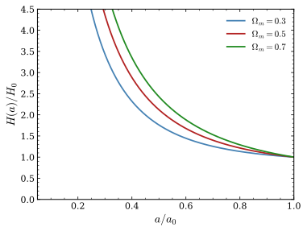

# Plot — physics-paper SVG figure generator

Generate a publication-quality SVG figure from an analytic relation. The SVG is written to disk and can be opened directly in VSCode without any extensions.

## Arguments
`$ARGUMENTS` — natural-language description of what to plot: the function(s), axis ranges, labels (LaTeX OK), title, and desired output filename. If no filename is given, choose a short descriptive name under `figures/`.

## How to proceed

1. **Understand the request** from `$ARGUMENTS`. Extract:
   - Function(s) to plot (express as Python/numpy expressions)
   - x-axis range and label (with units if given; enclose math in `$...$`)
   - y-axis label (same)
   - Optional: title, legend entries, log scale, multiple curves, annotations
   - Output filename (default: `figures/<descriptive-name>.svg`)

2. **Create the `figures/` directory** if it doesn't exist (use `mkdir -p figures`).

3. **Write a self-contained Python script** to the scratchpad (not the project), then run it. The script must follow the style rules below exactly.

4. **Run the script** with `python3 <path>`. If it errors, diagnose and fix, then re-run.

5. **Report** the output path. If the file is under the project root, show the relative path so the user can click it. Also show the markdown snippet to embed the figure:
   ```markdown
   
   *Figure 1: $H(a)/H_0$ vs scale factor for three values of $\Omega_m$.*
   ```
   This will render like this:

   
   *Figure 1: $H(a)/H_0$ vs scale factor for three values of $\Omega_m$.*

---

## Style rules (never deviate from these)

```python
import matplotlib
matplotlib.use('Agg')
import matplotlib.pyplot as plt
import numpy as np

# --- Physics-paper style ---
plt.rcParams.update({
    'text.usetex':        False,          # use built-in mathtext (no LaTeX install needed)
    'mathtext.fontset':   'cm',           # Computer Modern — standard in physics papers
    'font.family':        'serif',
    'font.size':          12,
    'axes.labelsize':     14,
    'axes.titlesize':     13,
    'legend.fontsize':    11,
    'xtick.labelsize':    11,
    'ytick.labelsize':    11,
    'axes.linewidth':     1.0,
    'xtick.direction':    'in',
    'ytick.direction':    'in',
    'xtick.top':          True,
    'ytick.right':        True,
    'xtick.minor.visible': True,
    'ytick.minor.visible': True,
    'lines.linewidth':    1.8,
})

fig, ax = plt.subplots(figsize=(5.5, 4.2))   # ~single-column width

# --- plot curves here ---

ax.set_xlabel(r'$x$-label here')
ax.set_ylabel(r'$y$-label here')
# ax.set_title(r'optional title')
# ax.legend(frameon=False)
# ax.set_xscale('log')  # if log scale requested

fig.tight_layout()
fig.savefig('figures/output.svg', format='svg', dpi=150, bbox_inches='tight')
print('Saved figures/output.svg')
```

### Color palette (use in order for multiple curves)
```
steelblue, firebrick, forestgreen, darkorange, mediumpurple, saddlebrown
```

### Math in labels
Wrap all math in `r'$...$'` using matplotlib mathtext syntax. Examples:
- `r'$H(z) / H_0$'`  
- `r'$\Omega_m a^{-3}$'`
- `r'$c / \dot{c}_0$'`
- `r'$\rho \propto a^{-4}$'`
- Subscripts/superscripts: `_{}` and `^{}`; fractions: `\frac{a}{b}`; Greek: `\alpha`, `\Omega`, `\dot{x}`, `\ddot{x}`

### Annotations
Use `ax.axhline`, `ax.axvline`, or `ax.annotate` for reference lines and labels. Keep annotations minimal.

### Multiple panels
Use `plt.subplots(1, 2, figsize=(10, 4))` or `(2, 1, figsize=(5.5, 7))` as appropriate. Share axes with `sharex=True` or `sharey=True`. Add `fig.subplots_adjust(hspace=0.05)` for vertical stacking.

---

## Important notes

- **Never** set `text.usetex = True` — it requires a LaTeX installation and will fail silently or crash.
- **Always** use raw strings `r'...'` for any label containing `\` or `$`.
- **Always** run `mkdir -p figures` before saving so the directory exists.
- **Always** print the output path after saving.
- Write the Python script to the session scratchpad, not to the project tree.
