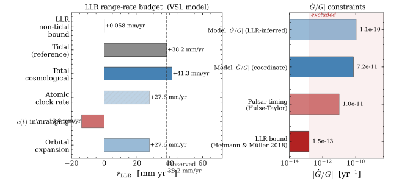

# T8 — The Gravitational Constant

## Observational Background

Newton's gravitational constant $G$ appears in the force law $F = GMm/r^2$ and in
Einstein's field equations as the coupling between spacetime curvature and the
stress-energy tensor. Locally, $G$ is measured to be:
$$G = 6.674 \times 10^{-11}\ \text{m}^3\,\text{kg}^{-1}\,\text{s}^{-2}.$$

Whether $G$ varies with time or position is tested by several methods:

- **Lunar Laser Ranging (LLR):** $|\dot{G}/G| < 1.5 \times 10^{-13}\ \text{yr}^{-1}$
  (95% CL; Hofmann & Müller 2018).
- **Pulsar timing** (especially the Hulse-Taylor binary): $|\dot{G}/G| < 10^{-11}\ \text{yr}^{-1}$.
- **Big Bang Nucleosynthesis:** constrains $G$ at $z \sim 10^{10}$ relative to today;
  limits $G$ variation to $\lesssim 20$–$30\%$ over cosmic history.
- **CMB acoustic peaks:** the position of the first acoustic peak constrains $G$ during
  recombination ($z \sim 1100$).

These constraints, taken together, suggest $G$ is constant to high precision over
both local (Solar System) and cosmological timescales.

---

## The Model's Prediction: $G \propto c^{-2}$

### Origin and value

In the Polarizable Vacuum (PV) framework (Puthoff 2002; Dicke 1957), gravity is
mediated by variations in the refractive index $K$ of the vacuum. The gravitational
potential is $\Phi = -GM/rc^2$, and the PV field equations relate $K = c_0/c$ to the
mass distribution. In this framework, the natural coupling is:
$$G \propto c^4/\Phi_\text{cosmic},$$
and with $\Phi_\text{cosmic} \sim c^6$ (from the cosmological $c \propto R^3$ law),
one obtains $G \propto c^{-2}$.

More directly: $G \propto c^{-2}$ is the **unique** power law that:
1. **Reproduces GR weak-field results** (the Schwarzschild metric and PPN parameters)
   in the PV framework.
2. **Gives orbital expansion $r \propto c^2$** with invariant mass (T9), which is
   required for constant stellar flux.
3. **Keeps the SN Hubble diagram self-consistent** under the squared redshift law.
4. **Passes through the Dicke (1957) "natural units" value**, which equates gravitational
   and inertial definitions of $G$.

For these reasons, $G \propto c^{-2}$ is strongly preferred — it satisfies four
independent constraints simultaneously — but it is **selected by agreeing constraints,
not derived from a first principle**. Providing a derivation from the relational
principle ($c \propto N$ → $G \propto c^{-2}$, perhaps via the connecton mechanism T14)
is a standing theoretical debt.

### Rate of change

With $G = G_0(c_0/c)^2 = G_0(1+z)$ using $c_\text{emit}/c_0 = (1+z)^{-1/2}$
(so $c_0/c_\text{emit} = (1+z)^{+1/2}$ and $(c_0/c_\text{emit})^2 = (1+z)$), the present-day
rate of change is:
$$\frac{\dot{G}}{G} = -2\frac{\dot{c}}{c} = -2H_0^{\text{hor}} = -\frac{2H_0^{\text{obs}}}{P}
= -H_0^{\text{obs}} \approx -7 \times 10^{-11}\ \text{yr}^{-1}.$$

(Using $P = 2$, so $H_0^{\text{hor}} = H_0^{\text{obs}}/2 \approx 3.5 \times 10^{-11}$
yr$^{-1}$; $\dot{G}/G = -2 \times 3.5 \times 10^{-11} \approx -7 \times 10^{-11}$
yr$^{-1}$.)

This is **roughly 500× larger than the LLR bound** ($1.5 \times 10^{-13}$ yr$^{-1}$).
This is a potential conflict between the model and Solar System data.

---

## Self-Consistent LLR Computation

The naive comparison ($\dot{G}/G_\text{model} \approx -7\times10^{-11}$ yr$^{-1}$
vs bound $1.5\times10^{-13}$ yr$^{-1}$) involves only $G$. The LLR observable couples
three independent effects: orbital expansion $r \propto c^2$ (T9), varying $c$ in the
ranging formula, and varying atomic clock rate $\nu \propto c^2$ (Core Principles §5a).
The self-consistent calculation follows.

### Round-trip ranging (what LLR actually measures)

The laser round-trip time in coordinate time is $\Delta t_\text{coord} = 2r_\text{EM}/c$.
The atomic clock accumulates ticks at $\nu(t) = \nu_0(c/c_0)^2$, so:

$$\Delta\tau = \nu(t)\,\Delta t_\text{coord} = \nu_0\!\left(\frac{c}{c_0}\right)^2 \cdot \frac{2r_0}{c_0}\!\left(\frac{c}{c_0}\right)^2\!\bigg/\!\left(\frac{c}{c_0}\right)
= \frac{2\nu_0 r_0}{c_0}\!\left(\frac{c}{c_0}\right)^3.$$

The LLR data reduction assumes $c = c_0$ and $\nu = \nu_0$, inferring:

$$r_\text{LLR}(t) = \frac{c_0\,\Delta\tau}{2\nu_0} = r_0\!\left(\frac{c}{c_0}\right)^3.$$

The LLR-measured range rate is therefore:

$$\frac{\dot{r}_\text{LLR}}{r_\text{LLR}} = 3\frac{\dot{c}}{c} = 3H_0^\text{hor} = \tfrac{3}{2}H_0^\text{obs}.$$

This factor of $\tfrac{3}{2}H_0^\text{obs}$ decomposes into three contributions:

| Effect | Scaling | Rate |
|:-------|:--------|-----:|
| Orbital expansion $r \propto c^2$ | $+2H_0^\text{hor}$ | $+27.6$ mm/yr |
| Speed of light in travel time | $-H_0^\text{hor}$ | $-13.8$ mm/yr |
| Atomic clock rate $\nu \propto c^2$ | $+2H_0^\text{hor}$ | $+27.6$ mm/yr |
| **Total cosmological (LLR-measured)** | $+3H_0^\text{hor}$ | **$+41.4$ mm/yr** |

The orbital expansion and clock rate both contribute; the speed-of-light factor partially
cancels. The net cosmological contribution to the LLR signal is **larger** than the
naively estimated coordinate orbital rate of 27.6 mm/yr.

### Orbital period

The coordinate orbital period: $T_\text{coord} = 2\pi/\omega$ with
$\omega^2 = G(t)M/r^3 \propto c^{-2}/c^6 = c^{-8}$, so $T_\text{coord} \propto c^4$.
In atomic clock time: $T_\text{atomic} = T_\text{coord}\cdot\nu/\nu_0 \propto c^4 \cdot c^2 = c^6$:

$$\frac{\dot{T}_\text{atomic}}{T_\text{atomic}} = 6H_0^\text{hor} = 3H_0^\text{obs}
\approx 2.15\times10^{-10}\ \text{yr}^{-1}, \quad
\dot{T}_\text{atomic} = 0.51\ \text{ms/yr.}$$

The cumulative timing residual after 50 years of LLR: $\delta t \approx \frac{1}{2}(3H_0^\text{obs})t^2 \approx 8.5\ \text{s.}$
LLR timing precision is nanoseconds per shot; an 8.5 s drift is unmistakable.

### Inferred $\dot{G}/G$

From Kepler's third law, $G_\text{fit} \propto r^3/T^2 \propto c^9/c^{12} = c^{-3}$:
$$\frac{\dot{G}_\text{fit}}{G_\text{fit}} = -3H_0^\text{hor} = -\tfrac{3}{2}H_0^\text{obs}
\approx -1.08\times10^{-10}\ \text{yr}^{-1}.$$

The self-consistent analysis **worsens** the tension by a factor of $\tfrac{3}{2}$ relative
to the naive estimate.

### Summary

*Figure: Left — LLR Earth-Moon range-rate budget. The cosmological term (41.4 mm/yr, blue)
is larger than the tidal dissipation (38.2 mm/yr, gray); together they predict 79.6 mm/yr,
more than twice the observed 38.2 mm/yr. The LLR non-tidal bound (0.058 mm/yr, red dashed
line) rules out the cosmological component by a factor of 717.
Right — log-scale comparison of $|\dot{G}/G|$ for the LLR bound, pulsar timing, and the
model's coordinate and LLR-inferred values.*

| Observable | Model prediction | Observed / bound | Tension |
|:-----------|:-----------------|:-----------------|:-------:|
| Non-tidal LLR range rate | $+41.4$ mm/yr | $< 0.058$ mm/yr | $\times 717$ |
| Cumulative period residual (50 yr) | $\sim 8.5$ s | $\sim 10^{-6}$ s (ns/shot) | $\gg 10^6$ |
| Inferred $\dot{G}/G$ (LLR pipeline) | $-1.08\times10^{-10}$ yr$^{-1}$ | $< 1.5\times10^{-13}$ yr$^{-1}$ | $\times 720$ |
| Total LLR range rate | $79.6$ mm/yr | $38.2$ mm/yr (observed) | $\times 2.1$ |

The self-consistent calculation does not reduce the tension. It is $\approx 50$% worse
than the naive $\dot{G}/G$ comparison because the clock-rate and ranging effects add to
the orbital expansion signal instead of cancelling it.

### Why tidal and cosmological contributions are independent

Tidal dissipation transfers angular momentum from Earth's spin to the Moon's orbit
(measurably slowing Earth's rotation by $\approx 1.7$ ms/century). The cosmological
expansion ($r \propto c^2$) follows from the adiabatic invariant $L = m\sqrt{GMr} = \text{const}$
as $G$ varies — it conserves the Moon's angular momentum and does NOT slow Earth. These
are therefore genuinely additive, and the tidal contribution cannot be re-attributed to
cosmological origin without violating Earth-rotation timing (independently measured by
atomic clocks and verified by geological records).

### The only escape: local screening

In Brans-Dicke scalar-tensor theories, high-density regions can be screened from
cosmological variations of the gravitational coupling ("chameleon mechanism"). In this
model, $c \propto N_\text{horizon}$ is driven by the global horizon count — the Solar
System is an infinitesimal perturbation on $N$. There is no identified mechanism by which
the local Solar System value of $c$ (and hence $G$) decouples from the cosmological
evolution. Providing such a mechanism (or proving none exists) is the key theoretical
task.

---

## Why Mass is Invariant (Not the PV Value)

In the PV framework (Puthoff 2002), the self-energy of a particle in the vacuum
field $K$ scales as $m \propto K^{3/2} \propto c^{-3/2}$. This gives $s = -3/2$, the
"PV mass" scaling. But the model adopts $s = 0$ (invariant mass).

The conflict between PV and invariant mass is unresolved. Several observations favour
$s = 0$:
- The SN Hubble diagram (T4) constrains $s$ via the redshift power $P = s+2$. Fits
  favour $s \approx 0$, not $s = -3/2$.
- Invariant mass is required for the symmetric-flip conservation structure (T11).

**Why is $m$ invariant rather than following the PV self-energy scaling?** This is
an open question. The PV self-energy gives $m \propto K^{3/2}$, but this
self-energy calculation may not be the correct treatment of mass in a fully
self-consistent variable-$c$ framework. The invariant-mass choice has better empirical
support; its theoretical justification is a standing debt.

---

## Cosmological Variation of $G$

The model predicts $G \propto c^{-2} \propto (1+z)$ — i.e., $G$ was larger in the
past. At $z = 1$: $G_\text{emit} = 2\,G_\text{now}$, a 100% increase. At $z = 5$:
$G \approx 6\,G_\text{now}$.

Observational tests:
- **BBN:** a larger $G$ at $z \sim 10^{10}$ would speed up the Hubble rate during
  nucleosynthesis, changing the freeze-out temperature and hence the $^4$He abundance.
  Current data allow $G$ to have been within $\sim 20$–$30\%$ of its present value
  at BBN; the model's prediction ($G$ larger by $\sim z$ at high $z$, giving
  $G \sim 10^{10}\,G_\text{now}$ at $z \sim 10^{10}$) is in severe tension with this
  bound. This has not been computed in detail.
- **Pulsar timing:** binary pulsar orbital decay measures $\dot{G}/G$ and constrains it
  more loosely than LLR ($\lesssim 10^{-11}$ yr$^{-1}$), still above the model's
  $7 \times 10^{-11}$ yr$^{-1}$.

---

## Open Questions

- ~~Self-consistent LLR computation~~ **Done (June 2026):** tension is $\times 720$ in
  $\dot{G}/G$ and predicts 79.6 mm/yr total LLR range rate vs observed 38.2 mm/yr. The
  self-consistent analysis worsens the naive estimate by 50%. The question is now whether
  any local screening mechanism can suppress the Solar System signal.
- **Local screening mechanism:** can the Solar System decouple from the cosmological
  $c(t)$ evolution? This would require that local physics uses a local $c$ (determined
  by local mass density or vacuum state) rather than the global horizon $c$. No such
  mechanism currently exists in the model. Without screening, the LLR and orbital
  expansion constraints appear to exclude the model.
- **The BBN constraint on $G$ at $z \sim 10^{10}$:** the model predicts
  $G_\text{BBN} = G_0(1+z_\text{BBN}) \approx 10^{10}\,G_0$ — a factor of $10^{10}$
  increase. This would dramatically speed up the Hubble rate during nucleosynthesis and
  is almost certainly incompatible with the observed $^4$He abundance. Whether the BBN
  constraint is also subject to the same screening question as LLR is unresolved.
- **Theoretical derivation of $G \propto c^{-2}$** from the relational principle
  ($c \propto N$ → $G \propto c^{-2}$). The connecton mechanism (T14) is the leading
  candidate if the ballistic/diffusive dilemma can be resolved.
