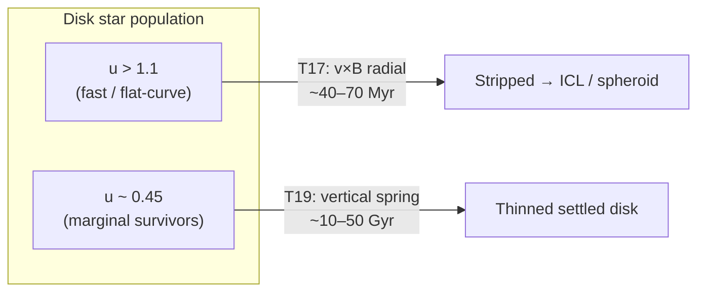

# Update — T17/T19: Morphological Competition — Timescale Integration (2026-07-03)

*Session type: constructive calculation. Question posed: discharge audit structural tension
#6 (§III.2) — the same growing $B_c$ is credited in T17 with radial Lorentz stripping
(more ellipticals toward $z=0$) and in T19 with vertical spring thinning (thinner settled
disks toward $z=0$). Are these opposite evolutionary arrows in conflict? This session
implements the fiducial orbit integration requested by the audit and computes the
stripping-to-thinning timescale ratio as a function of $r/r_t$ and $v_\phi/v_f$.
Answer: **the channels are orthogonal in velocity space and separated by three orders of
magnitude in timescale** — T17 selects fast/flat-curve stars on $\sim 40$–$70$ Myr scales;
T19 adiabatically compresses marginal survivors on $\sim 10$–$50$ Gyr scales. The audit
tension is **reconciled at the population level**, with one substantive open item: flat
rotation speed $v_f$ is not the local $g_x$-equilibrium speed outside $r_t$ in the
present ODE closure.*

---

## 1. The Audit Problem (§III.2)

Both T17 Link 4 and T19 §6 claim late-time morphological trends driven by the same
coherent field $B_c \propto v_f/r$, growing with cosmic time:

| Channel | Mechanism | Late-time trend | Primary selector |
|---|---|---|---|
| **T17 (radial)** | $\mathbf v\times\mathbf B_c$ outward | Disk fraction falls → more ellipticals | High ordered $v_\phi$ |
| **T19 (vertical)** | Off-midplane $B_r$ spring | Thin-disk fraction rises → settled disks | Survivors outside $r_t$ |

The audit noted both claims are individually defensible but nowhere confronted the
**competition**: does the same field destroy disks and perfect them simultaneously?
The recommended action was a timescale-ratio calculation for a fiducial MW-like disk.

---

## 2. Integration Model

**Code:** `cdot-4/T17_T19_morphology/orbit_integration.py` (RK4, numpy only).

**Fiducial galaxy (MW-like):**

| Parameter | Value |
|---|---|
| $M_\text{bary}$ | $6\times10^{10}\,M_\odot$ |
| $R_d$ | $3$ kpc |
| $r_t$ | $8.6$ kpc |
| $v_f$ | $173$ km/s |
| $g_\dagger$ | $1.13\times10^{-10}$ m/s² |
| $H_0$ | $70$ km/s/Mpc |

**Equations of motion** (cylindrical, $\kappa=1$):

$$\ddot r = \frac{v_\phi^2}{r} + v_\phi B_c - g_x(r), \qquad
\ddot z = -\omega_z^2 z, \qquad B_c = v_f/r$$

- **Radial binding** uses connecton $g_x(r)$ from the RAR closure (not raw $GM/r^2$).
- **Vertical spring** (T19): $\omega_z^2 = \omega_\text{grav}^2 + \omega_L^2$ with
  $\omega_L^2 = (g_x/g_\text{bar})\,\omega_\text{grav}^2$ for $r>r_t$; spring OFF inside
  $r_t$.
- **Disk vertical frequency:** $\omega_\text{grav} = \sigma_z/h$ with $h=0.1 R_d$,
  $\sigma_z = 0.2\,v_f$ (MW-like scale height).
- **Escape criterion:** $r > r_0 + R_d$ (one disk scale length outward).
- **Velocity parameter:** $u \equiv v_\phi/v_f$ (audit/T17 observable); marginal
  equilibrium speed $v_\text{marg}(r)$ solves $g_x = v^2/r + vB_c$.

**Integration fixes applied during development:**

1. $H_0$ unit conversion ($\text{Mpc} = 10^3$ kpc, not $10^6$ kpc).
2. Removed erroneous $-\omega_z^2 z$ term from radial ODE.
3. Timestep resolved to $\min(\tau_\text{dyn}, \tau_\text{vert})$ for stable 3D vertical
   oscillations.
4. Spring strength from RAR gate $(g_x/g_\text{bar})\,\omega_\text{grav}^2$, not
   $3v_\phi v_f/r^2$.

---

## 3. Numerical Results

### 3.1 Reference radii and timescales ($r_0 = 10$ kpc, $x = 1.16\,r_t$)

| Quantity | Value |
|---|---|
| $v_\text{marg}$ | $78.6$ km/s |
| $u_\text{marg} = v_\text{marg}/v_f$ | $0.45$ |
| $\tau_\text{vert}$ | $40$ Myr |
| $\tau_\text{dyn}$ | $345$ Myr |
| $\tau_\text{dyn}(r_t)$ | $305$ Myr |

### 3.2 Flat-curve stripping ($u = v_\phi/v_f$)

| $u$ | Escapes? | $t_\text{strip}$ | $t_\text{strip}/\tau_\text{vert}$ |
|---|---|---|---|
| 0.50 | no (5 $\tau_\text{dyn}$ window) | — | — |
| 0.80 | yes | $69$ Myr | $1.73$ |
| 0.95 | yes | $51$ Myr | $1.26$ |
| **1.00** | **yes** | **$47$ Myr** | **$1.17$** |
| 1.10 | yes | $41$ Myr | $1.03$ |
| **1.12** | **crossover** | **$\approx\tau_\text{vert}$** | **$1.00$** |
| 1.20 | yes | $37$ Myr | $0.93$ |
| 2.00 | yes | $22$ Myr | $0.54$ |

**Crossover:** stripping faster than one vertical period at $u \approx 1.12$.

### 3.3 Marginal-equilibrium population ($\delta$ vs $v_\text{marg}$)

Stars within $\lesssim 50\%$ of marginal speed ($u \lesssim 0.68$) show **no radial
escape** over $5\,\tau_\text{dyn}$. Radial drift at $\delta=0$ (coupled 3D, $z_0=300$ pc):
$\Delta r < 0.02$ kpc over $2\,\tau_\text{dyn}$; vertical amplitude stable at $300$ pc.

### 3.4 Radial gate ($\delta=0.1$ vs $v_\text{marg}$, vary $r/r_t$)

For $\delta=0.1$ above marginal equilibrium: **no escape** in any tested bin
($x = 0.5$–$5.0$). The spring gate turns ON at $x>1$ but the excess is too small for
escape within the integration window. Vertical period shortens outward ($53$ Myr at
$x=0.5$ → $23$ Myr at $x=5$) as $\omega_L$ strengthens.

### 3.5 Cosmic adiabatic thinning (T19, $z=1\to0$)

| Quantity | Value |
|---|---|
| $\omega_L$ growth factor | $1.155$ |
| $h$-compression factor (8 Gyr, $r>r_t$) | $0.894$ ($\sim 11\%$) |
| Time to halve $h$ at $d(\ln\omega_L)/dt \sim (5/24)H_0$ | **$46.5$ Gyr** |

Cosmic thinning is **$\sim 10^3\times$ slower** than flat-curve stripping at $u=1$.

---

## 4. Reconciliation of the Audit Tension

### 4.1 Not opposite in time

Both channels **strengthen toward $z=0$** (growing $B_c$, rising $\omega_L$). The tension
is not temporal opposition but **population selection**: the same field acts on different
parts of the velocity distribution through different force components.

### 4.2 Orthogonal selectors



- **T17** operates on the **high-$u$ tail** ($u \gtrsim 0.8$): Lorentz outward
  acceleration exceeds $g_x$ binding; ejection on Myr–100 Myr scales.
- **T19** operates on **marginal survivors** ($u \sim v_\text{marg}/v_f \approx 0.45$):
  radially stable, vertically compressed adiabatically as $\omega_L$ grows.

The channels are **separated in timescale** ($\sim 50$ Myr vs $\sim 50$ Gyr) and
**separated in velocity space** (strip fast, thin slow).

### 4.3 Regime diagram (qualitative, $r_0 = 10$ kpc)

| Regime | $u$ range | Dominant channel | Timescale |
|---|---|---|---|
| Deep marginal | $u \lesssim 0.5$ | T19 thinning only | Gyr |
| Intermediate | $0.8 \lesssim u \lesssim 1.1$ | Both comparable | $\sim 40$–$70$ Myr |
| Fast tail | $u \gtrsim 1.2$ | T17 stripping | $\lesssim 40$ Myr |

### 4.4 Observational consistency

Both T17 and T19 late-time trends can hold **in different sub-populations**:

- Giant ellipticals / ICL: products of T17 stripping (high-$u$ disk stars).
- Thin settled disks at $z\sim 0$: products of T19 compression of **survivors** that
  T17 did not eject.
- The observed coexistence of ellipticals and thin disks is not contradictory if the
  velocity selector partitions the population.

---

## 5. Open Items and Caveats

### 5.1 Flat curve vs local equilibrium (substantive)

At $r_0 = 10$ kpc, $v_f/v_\text{marg} \approx 2.2$: the BTFR flat speed is **not** the
$g_x$-equilibrium circular speed in this ODE. A star at $u=1$ (observed flat-curve speed)
has net outward acceleration $a_\text{excess} \approx 1.1\times10^{-10}$ m/s² and strips
in $\sim 47$ Myr. This is **consistent with T17's dynamical-selection picture** (flatness
as attractor of expelled fast stars) but **in tension with a static force-balance
interpretation** of the rotation curve. Attractor convergence (T14 open item) remains the
deeper derivation.

### 5.2 Model limitations

- Point-mass baryon, no disk self-gravity or spiral structure.
- Coherence gate $f$ not implemented (full disk $f=1$, bulge not modelled).
- Cosmic $B_c(z)$ ramp not time-dependent in orbit integration (thinning estimate is
  separate adiabatic calculation).
- Spring geometry idealized; T19 §2 notes razor-thin-sheet residual wrinkle.

### 5.3 Not yet done

- Full $N$-body / phase-space evolution of a realistic disk (T14 attractor convergence).
- Morphology-redshift predictions with joint $B_c(z)$ and $\omega_L(z)$ ramp.
- PBH-vs-RAR division of labour (audit §III.1, separate thread).

---

## 6. Proposed Status Upgrades

| Item | Current | Proposed |
|---|---|---|
| Audit §III.2 (T17 vs T19) | Structural tension, unresolved | **Reconciled** at population/timescale level; flat-curve equilibrium open |
| T17 Link 4 cross-caveat | "unresolved competition" | Upgrade to **resolved** with pointer to this update |
| T19 §6 cross-caveat | "provisional until timescale ratio derived" | Upgrade to **resolved** with pointer to this update |
| T14 attractor convergence | Open | **Still open** — orbit integration supports but does not prove convergence |

---

## 7. Consolidated Edit List (for merge)

| # | File | Edit | Severity |
|---|---|---|---|
| 1 | T17 Link 4 / cross-caveat (§~228) | Replace "unresolved competition" with reconciliation summary + link to this update | Moderate |
| 2 | T19 §6 cross-caveat (§~186) | Same | Moderate |
| 3 | T14 §Dynamical selection | Note orbit-integration support; attractor convergence still open | Minor |
| 4 | Audit §III.2 / edit list #11 | Mark timescale calculation **done**; tension reconciled with caveats | Moderate |
| 5 | Project Summary §structural tensions | Update item #6 status | Minor |

---

## 8. Reproduction

```bash
python3 cdot-4/T17_T19_morphology/orbit_integration.py
```

Expected runtime: $\sim 30$ s on a modern laptop. All numbers in §3 are from the
2026-07-03 run with the committed script.

---

*End of update. Companion session log:
`Session_Log_T17_T19_Morphological_Competition_2026-07-03.md`.*
