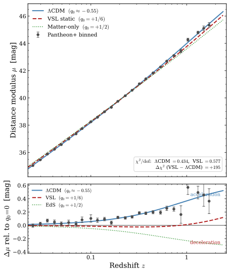

# T4 — Supernovae and Cosmic Acceleration

## Observational Background

Type Ia supernovae (SNe Ia) are used as cosmological "standard candles": their peak
luminosities are approximately uniform (with empirical corrections via the
Phillips relation between peak brightness and decline rate, and colour), allowing
distances to be inferred from observed fluxes. The luminosity distance $D_L$ is:
$$\mu = 5\log_{10}\!\left(\frac{D_L}{10\ \text{pc}}\right), \qquad D_L = (1+z)D_\text{p}.$$

The 1998 discovery (Riess et al., Perlmutter et al.) that distant SNe Ia ($z \sim 0.3$–$1$)
appear $\sim 0.2$–$0.3$ magnitudes **dimmer** than expected in a matter-only decelerating
universe was the primary evidence for cosmic acceleration and the dark energy ($\Lambda$).
The result has been confirmed and extended by the Pantheon and Pantheon+ datasets
(Scolnic et al. 2018, Brout et al. 2022), which together cover $0 < z < 2.3$.

The inferred cosmological deceleration parameter for ΛCDM is $q_0 \approx -0.55$
(with $\Omega_m \approx 0.3$, $\Omega_\Lambda \approx 0.7$), indicating that the
expansion of the universe is currently accelerating.

---

## The Model's Prediction: Structural Deceleration

### The deceleration parameter

For a general power-law horizon $c \propto R^n$ (volume law $n=3$, surface law $n=2$,
S′ law $n=2/3$) combined with the squared redshift law ($P = s+2 = 2$ for $s=0$) and
the standard-candle luminosity distance $D_L = (1+z)D_\text{p}$, the deceleration
parameter is:
$$\boxed{q_0 = \frac{1}{nP}.}$$

For the preferred volume law ($n=3$, $P=2$): $q_0 = 1/6 \approx +0.17$.

This is **strictly positive for any $n > 0$ and $P > 0$**. The model predicts mild
deceleration, not acceleration.

### Why $q_0 < 0$ is structurally impossible

For $q_0 < 0$, one needs either $n < 0$ or $P < 0$. But:

- **$n < 0$ means $c$ was larger in the past**, so $c_\text{emit} > c_\text{now}$, which
  gives $1+z < 1$ — a blueshift. This is refuted by the observed ubiquity of
  cosmological redshift.
- **$P < 0$ means $s < -2$**, a mass scaling $m \propto c^s$ with $s < -2$. This is
  exotic, unmotivated, and would imply mass growing faster than $c^2$ as $c$ decreases —
  physically unreasonable.

**There is no version of this model that mimics dark energy.** This is a structural
result, not a numerical coincidence. The model cannot mimic cosmic acceleration
regardless of parameter choices.

### The SN magnitude residual

Using $P = 2$ and $H_0^{\text{obs}} = 70$ km/s/Mpc, the luminosity-distance residuals
compared to the concordance ΛCDM model are:

| $z$ | $D_L$ (model) | $D_L$ (ΛCDM) | $\Delta\mu$ |
|---:|---:|---:|---:|
| 0.1 | 445 Mpc | 460 Mpc | $-0.07$ |
| 0.5 | 2519 Mpc | 2833 Mpc | $-0.26$ |
| 1.0 | 5607 Mpc | 6608 Mpc | $-0.36$ |
| 2.0 | 12898 Mpc | 15540 Mpc | $-0.40$ |
| 5.0 | 39803 Mpc | 46652 Mpc | $-0.34$ |

$\Delta\mu < 0$ means the model predicts SNe are **brighter** (closer) than ΛCDM.
Equivalently, the model predicts SNe are slightly less dim than a decelerating universe
would give — but not as faint as a ΛCDM accelerating universe predicts. Since the
original SN discovery compared to a flat matter-dominated model, and found SNe *dimmer*,
the model sits between the matter-only expectation and ΛCDM.

The residual has a **shape** (peaks near $z \approx 2$, falls at low and high $z$), not
a flat offset. This shape encodes the $q_0 = +1/6$ deceleration signal.

---

## The Horizon-Law Variants

### Volume law ($c \propto R^3$, baseline)

$q_0 = 1/6$. No finite coordinate-time origin; the horizon has grown from $c = 0$
infinitely far in the past (in coordinate time).

### Surface law ($c \propto R^2$)

$q_0 = 1/4$. Slightly larger deceleration, slightly worse SN tension.

### S′ law ($c \propto R^{2/3}$)

$q_0 = 3/4$. This variant was initially thought to mimic acceleration (under the old
linear redshift law), but that was an artifact of the incorrect linear law. With the
corrected squared law, S′ gives $q_0 = 3/4$, which is **worse** than the volume law.

S′ has one remaining attractive feature: it gives a **finite coordinate-time origin**
(a genuine Big Bang in map time). This was previously thought to be required for
primordial black hole formation at genesis, but that requirement has been removed —
under Reading 2 (T13), PBH relic freeze-out at the $r_s/R \sim 1$ crossover is
generic to any counting law. S′'s remaining advantage is the finite-coordinate-origin
aesthetic, a weaker consideration. The volume law therefore carries both the mildest
SN tension ($q_0 = 1/6$) and the PBH genesis program.

---

## What This Means for the Model

The SN tension is the model's most serious empirical constraint. Two framings:

**Framing 1 (pessimistic).** The Pantheon+ data robustly establish $q_0 < 0$ at $> 5\sigma$.
The model predicts $q_0 > 0$. The model is excluded.

**Framing 2 (honest and open).** The $q_0 < 0$ conclusion rests on SNe Ia being
standard candles to better than $\sim 0.1$–$0.2$ mag precision over the full $z$ range.
This is non-trivial. The Phillips correction and colour correction are empirical; there
are ongoing debates about host-galaxy systematics, Milky Way dust, and potential
evolution of the SN population with redshift. The Pantheon+ analysis derives
$q_0 \approx -0.55$ within ΛCDM; it has not been done within this model's framework.

The honest statement is: **the model cannot mimic dark energy, and its viability
therefore depends entirely on an external empirical question — whether cosmic
acceleration is as robustly established as currently believed, specifically whether
SNe Ia are reliable standard candles to the precision the acceleration claim requires.**
This is a live debate in the community (see e.g. discussions of stretch-parameter
evolution, SHOES vs. UNITY analyses, and dust modelling uncertainties).

### What is needed

A genuine comparison requires fitting the Pantheon+ dataset directly within the model's
framework — using the model's $D_L(z)$ formula and its own covariance structure rather
than comparing model predictions to ΛCDM-derived posteriors. This has been done (see
§ Pantheon+ Fit Results below; script is in cdot-3/fit_pantheon.py); the next step is
to replace the diagonal errors with the full stat+sys covariance matrix.

---

## Pantheon+ Fit Results (June 2026)

Script: `cdot-3/fit_pantheon.py` (unchanged, G-independent). Data: Brout et al. 2022 (`data/Pantheon+SH0ES.dat`).
Sample: 1371 Hubble-flow SNe ($z > 0.023$, Cepheid calibrators excluded).
Fit strategy: for each model a single nuisance parameter (absorbing $M_B + 5\log_{10}H_0$)
is fitted analytically as the inverse-variance-weighted mean offset; the shape of $D_L(z)$
is the sole discriminant. Errors are diagonal only (`MU_SH0ES_ERR_DIAG`); the full
$1701\times1701$ stat+sys covariance matrix is on disk for future use.

*Figure 1: Upper — Hubble diagram with binned Pantheon+ data and best-fit model curves.
Lower — shape residuals $\Delta\mu$ relative to the $q_0=0$ coasting universe
($\Omega_m=2/3$, $\Omega_\Lambda=1/3$), using the ΛCDM-calibrated $H_0$ as the common
zero-point. Data and ΛCDM rise together above the neutral reference; VSL sits near zero;
EdS falls below.*

### $\chi^2$ summary (diagonal errors, $\mathrm{dof} = 1370$)

| Model | $q_0$ | $\chi^2/\mathrm{dof}$ | $\chi^2$ | $H_0^{\rm eff}$ [km/s/Mpc] |
|:------|------:|---------------------:|---------:|---------------------------:|
| ΛCDM ($\Omega_m=0.30$, $\Omega_\Lambda=0.70$) | $-0.55$ | **0.435** | 595 | 73.65 |
| $q_0=0$ coasting ($\Omega_m=2/3$, $\Omega_\Lambda=1/3$) | $0$ | 0.566 | 775 | — |
| VSL static (volume law, $P=2$, $n=3$) | $+1/6$ | 0.577 | 791 | 69.22 |
| EdS ($\Omega_m=1$, $\Omega_\Lambda=0$) | $+1/2$ | 0.854 | 1170 | 66.95 |

All $\chi^2/\mathrm{dof} < 1$ because the diagonal errors overestimate the true scatter
(the Pantheon+ pipeline propagates a full covariance; diagonal entries alone are
conservative). The relative ordering and $\Delta\chi^2$ values are meaningful even if the
absolute normalisation is not.

**$\Delta\chi^2$ (VSL $-$ ΛCDM) $= +195.4$** — a large penalty concentrated at $z < 0.3$
where the SN density is highest and the VSL curve departs most noticeably from ΛCDM.

### $\Delta\mu$ between VSL and ΛCDM (after best-fit offsets)

| $z$ | $\Delta\mu$ [mag] |
|----:|------------------:|
| 0.10 | $+0.064$ |
| 0.20 | $+0.004$ |
| 0.50 | $-0.121$ |
| 1.00 | $-0.222$ |
| 1.50 | $-0.260$ |
| 2.00 | $-0.270$ |
| 2.30 | $-0.269$ |

The sign flip near $z \approx 0.2$ reflects the offset-fitting absorbing the low-$z$
discrepancy into $H_0^{\rm eff}$: VSL needs $H_0 = 69.2$ km/s/Mpc to match the data,
whereas ΛCDM needs $H_0 = 73.6$ km/s/Mpc. After the offsets are removed, VSL is brighter
than ΛCDM at low $z$ (where the deceleration signal is small and $H_0$ dominates) and
dimmer at high $z$ (where the difference in $D_L$ shape is largest).

### Interpretation

The VSL model is **disfavoured relative to ΛCDM at $\Delta\chi^2 \approx +195$** on the
diagonal-error metric, confirming that the observed SN brightnesses are inconsistent with
mild deceleration ($q_0 = +1/6$) at the level the current data allow. The model sits
between the $q_0=0$ coasting universe and EdS — it predicts SNe brighter than ΛCDM at
all $z > 0.2$, which is the opposite of what the data require.

Two steps are needed before treating this as a definitive exclusion. First, repeat the fit
using the full $1701\times1701$ stat+sys covariance matrix (`data/Pantheon+SH0ES_STAT+SYS.cov`)
to obtain a correctly normalised $\chi^2/\mathrm{dof}$ and formal significance. Second, the
fit above does not yet include the Chandrasekhar-mass candle systematic introduced by
invariant $G$ ($M_\text{Ch}\propto c^{3/2}$, §below), which adds a $z$-dependent intrinsic
dimming on top of the $q_0 = +1/6$ curve. The net sign of that systematic on the residuals
is currently undetermined (gated by the ejecta-velocity scaling $q$); the picture could
improve or worsen once it is included.

---

## The Standard-Candle Assumption in the Model

The explicit flux integral confirms the assertion. Three steps carry the derivation.

**Proper-time stretch.** Atomic clocks scale as $\nu\propto c^2$ (Core Principles §5a),
so the ratio of observation-epoch to emission-epoch proper duration per photon is
$d\tau_\text{obs}/d\tau_\text{emit} = (c_0/c_e)^2 = (1+z)$. Time dilation here
is derived from clock-rate scaling and photon-number conservation, not metric expansion.

**Per-photon energy (the non-obvious step).** Premise 4 states the photon's absolute
frequency is conserved in flight. The emission-epoch clock ran slow by $(c_e/c_0)^2$
relative to today, so the proper emission frequency $\nu_e$ corresponds to absolute
frequency $\nu_o = \nu_e/(1+z)$ — and it is $h\nu_o$ that a detector deposits, not
$h\nu_e$. The apparent "redshift energy factor" is a proper-vs-absolute frequency
difference at the source, not an in-flight energy loss (premise 4 forbids the latter).
Misreading this step as $h\nu_e$ would give $D_L = (1+z)^{1/2}D_\text{p}$; the
correct reading restores $D_L = (1+z)D_\text{p}$.

**The observable.** Assembling bolometric flux ($h\nu_o$ per photon, arrival duration
stretched by $(1+z)$, spread over $4\pi D_\text{p}^2$) confirms $D_L=(1+z)D_\text{p}$.
The actual survey observable — peak specific flux $F_\nu$ plus K-correction — gives the
same result: at the instant of peak the rate-dilation $1/(1+z)$ and bandwidth $(1+z)$
cancel, leaving one power of $(1+z)$ from the per-photon energy alone. The K-correction
depends only on the frequency mapping $\nu_e=(1+z)\nu_o$ and the intrinsic SED shape,
both identical to FRW; SALT2/Pantheon+ pipelines apply unchanged.

**Why stellar luminosity drift does not affect the SN distance ladder in the general case.** The SN flux
chain runs entirely within the photon/atomic sector: emission energy, photon frequency,
and clock rate share the *same* power structure, so all $c$-factors reassemble into the
clean $(1+z)$ powers above. Gravity never enters the photon's journey. With $L\propto c^0$
(T18: corrected Eddington/electron-scattering mass–luminosity relation), ordinary stellar
luminosity has no net $c$-drift at fixed composition; any constant rescaling is absorbed
into $M_B$ and introduces no $z$-dependent terms.

**However, the SN Ia candle is not an ordinary star.** It detonates near the Chandrasekhar
mass, which carries its own $c$-dependence under invariant $G$ that is *not* a constant
offset and does *not* drop out of the Hubble-diagram fit. This is a separate systematic
addressed in §The Chandrasekhar-Mass Candle Systematic below.

---

## The Chandrasekhar-Mass Candle Systematic

### $M_\text{Ch}\propto c^{3/2}$

Type Ia SNe are standardisable because they detonate near the Chandrasekhar mass:
$$M_\text{Ch}\propto\left(\frac{\hbar c}{G}\right)^{3/2}\frac{1}{m_p^2}.$$
Under invariant $G$ (and invariant $\hbar, m_p$) with $c$ varying:
$$M_\text{Ch}\propto c^{3/2}.$$
In the past ($c$ smaller) the detonating mass — and hence the $^{56}$Ni yield powering
the light curve — was smaller. With the redshift law $c_\text{emit}/c_\text{now} =
(1+z)^{-1/2}$, any candle quantity scaling as $c^k$ acquires a factor $(1+z)^{-k/2}$.
Unlike a constant offset, this is **$z$-dependent** and does not drop out of the fit.
High-$z$ SNe Ia are **intrinsically fainter** in the model than at low $z$.

### The robust bound: total radiated energy

The time-integrated bolometric output equals the nuclear energy released by the
$^{56}$Ni→$^{56}$Co→$^{56}$Fe chain:
$$E_\text{total} = M_\text{Ni}\times(\text{energy per unit mass})\propto c^{3/2}\cdot c^{2} = c^{7/2}.$$
This is rate-independent and width-independent — the most trustworthy statement. As a
magnitude shift (positive = fainter at high $z$):
$$\Delta m = +\tfrac{5}{2}\cdot\tfrac{7}{4}\log_{10}(1+z) = +4.375\log_{10}(1+z).$$
Representative values: $+0.18$ mag at $z=0.1$; $+0.77$ mag at $z=0.5$; $+1.3$ mag at
$z=1$. There is no double-counting with the flux-chain factors: T4's $(1+z)$ terms are
propagation/clock effects on the *same* photons; this is the *source* being intrinsically
weaker, so they multiply independently.

**Direction is favourable** (the existing residual has VSL predicting SNe too *bright*
at high $z$; this dims them). **Magnitude taken raw overshoots massively** — far larger
than the $\lesssim0.12$ mag residual available in the data-rich $0.1 < z < 0.5$ window —
and would make the model predict SNe much too *faint*, worsening the fit.

### Whether Phillips standardisation absorbs the systematic

The raw dimming can only be reconciled with data if the Phillips width–luminosity
calibration absorbs most of it — i.e. the $M_\text{Ch}$ shift moves SNe *along* the
observed brighter–broader locus, so the pipeline calibrates it away. This hinges on the
**ejecta expansion velocity scaling** $v_\text{exp}\propto c^{-q}$. The light-curve
diffusion time scales as $\tau_\text{LC}\propto c^{(q/2-3/4)}$ (Arnett); the model's
track slope is:
$$\frac{d\log L_\text{peak}}{d\log\tau_\text{LC}} = \frac{17-2q}{2q-3}.$$
This matches the observed Phillips slope ($\sim+2$ to $+3$) only for $q\approx 3.3$–$3.8$
(absorption works); for small or negative $q$ the slope is large-negative
(brighter–narrower, opposite to Phillips → no absorption → fit worsens).

**The sign of $q$ is currently not settled.** Two physical arguments disagree:

- *Opacity argument (favourable, $q>0$):* lengths are larger in the past ($\propto c^{-1}$),
  so opacity is higher ($\kappa\propto c^{-2}$), coupling radiation more strongly and driving
  higher past expansion velocities — the direction that can yield Phillips-parallel behaviour.
- *Self-consistent radiation-hydro (unfavourable, $q=-1$):* closing the coupled system
  (impulse $a=\kappa F/c$, diffusion time, expanding radius, $E_\text{rad}\sim E_\text{nuclear}$,
  fixed kinetic fraction) gives $v_\text{exp}\propto c^{+1}$ ($q=-1$). Higher opacity
  increases trapping but also reduces flux; the net dynamics place the candle
  **off** the Phillips locus (fit worsens).

The two arguments address slightly different questions: the self-consistent solve held the
kinetic-energy fraction $f_\text{KE}$ fixed; the opacity argument implicitly lets
$f_\text{KE}$ rise with $\kappa$ (more trapping → more work on ejecta). The crux — the
opacity-dependence of the kinetic/radiated energy partition — is not settleable by
dimensional scaling alone and requires a radiation-hydrodynamics treatment.

A second input: the $^{56}$Ni weak-decay rate scaling. T21 derives this from an
"invariant coupling + Compton-wavelength" extension of the model's EM-sector treatment
(T7) to the strong and weak sectors: invariant $G_F$ (from invariant $g_w,M_W$) plus
invariant nuclear $Q$-values (from invariant nuclear mass differences) give **energy per
decay $\propto c^2$** (now derived, confirming the earlier placeholder) and **decay rate
$\propto c^4$** (correcting the earlier placeholder of $\propto c^2$). Even under this
scaling the peak-luminosity route is gated by $q$; the $E_\text{total}\propto c^{7/2}$
bound is independent of the rate and unaffected. See T21 for the derivation and its
standing caveat (the invariant-coupling premise is natural but not unique).

### Effect on the fit (honest summary)

The Chandrasekhar-mass systematic adds a real, robust, $z$-dependent intrinsic dimming
on top of the $q_0 = +1/6$ kinematic curve. Sign is favourable; raw magnitude massively
overshoots. Net outcome is **undetermined**: requires resolving the sign of $q$ and
confirming whether the Pantheon+ pipeline standardises on peak luminosity or on fluence
(the two carry different $c$-scalings). This is a genuine new tension introduced by
invariant $G$, not yet resolved.

---

## Open Questions

- ~~A direct Pantheon+ fit~~ **Done (June 2026):** $\Delta\chi^2 = +195$ on diagonal
  errors. Next: repeat with the full stat+sys covariance matrix (`data/Pantheon+SH0ES_STAT+SYS.cov`)
  to obtain a correctly normalised $\chi^2/\mathrm{dof}$ and formal significance.
- **Resolve the sign of $q$** ($v_\text{exp}\propto c^{-q}$): does the
  opacity-dependence of the kinetic/radiated energy partition $f_\text{KE}(\kappa)$
  push $q$ into the Phillips-absorption window ($q\approx 3.3$–$3.8$), or does the
  self-consistent radiation-hydrodynamics result ($q=-1$) win? **This single exponent
  gates SN viability** — it determines whether the $M_\text{Ch}$ systematic improves or
  worsens the fit. Requires a radiation-hydro treatment that floats both dynamics and the
  energy partition simultaneously.
- ~~Specify the weak sector's $c$-scaling~~ **Addressed (T21):** decay rate
  $\propto c^4$, energy per decay $\propto c^2$, under an invariant-$G_F$ premise. The
  peak-luminosity route remains gated by $q$; the ignition-mass question (T21 Part 4) is
  the live path toward resolving the overcorrection, not the total-energy bound.
- **Redo the Pantheon+ fit with $M_\text{Ch}$ candle evolution included**, as a function
  of the net Phillips-absorbed fraction, restricted to the well-constrained $0.1 < z < 0.5$
  window where data dominate; quantify whether any plausible $q$ yields a fit competitive
  with $\Delta\chi^2 = +195$.
- **Standardisation observable:** does the Pantheon+ pipeline effectively standardise
  on peak luminosity or on fluence? The two carry different $c$-scalings
  ($L_\text{peak}$ vs $E_\text{total}\propto c^{7/2}$) and the answer changes the net.
- What is the constraint on the mass-scaling exponent $s$ from SN data? The shape
  of $\mu(z)$ is sensitive to $P = s+2$; a MCMC fit could constrain $s$.
- If the SN data firmly require $q_0 < 0$ even after model-native analysis, the model
  is definitively excluded — this outcome should be pursued, not avoided.
- The Etherington reciprocity relation $D_A = D_L/(1+z)^2$ is satisfied exactly by the
  model (the model sits on the Etherington line). This means it makes the same
  angular-diameter–luminosity-distance connection as ΛCDM, providing a consistency
  check between SN distances and angular-size measurements (e.g. BAO).
