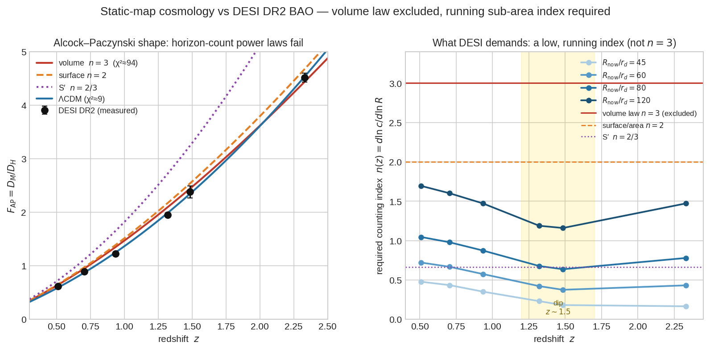

# UPDATE — The Static Map Survives: c(z) Inversion Against DESI (CONSTRUCTIVE)

*Status: proposed update, for cross-check and merge. Session 2026-07-04 (cont.).*
*Targets: Core §3, §4, §4a (horizon law, distance), T4 (counting-law variants), T12 (premise-2 fork).*
*Depends on: UPDATE_BAO_Alcock-Paczynski_Shape_Test.md, UPDATE_ForkA_BH_Confined_Mass_NEGATIVE.md (same session).*
*Figure: desi_static_map.png (same session).*

---

## Summary — an important correction and a live path

Two prior updates this session showed (i) the horizon-count $D_p(z)$ fails the
BAO AP shape at $\chi^2\approx94$/6, and (ii) a BH-confined-mass symmetry breaker
fails by orders of magnitude. This update **reframes the situation and clears the
static map itself of the charge**:

1. **Correction.** The identity $D_H=dD_M/dz$, earlier proposed as a static-map
   discriminator, is **universal** — it holds in $\Lambda$CDM and any FRW model,
   since $dD_M/dz=c/H=D_H$ by construction. It does **not** distinguish the
   static map from anything, and cannot falsify it. The earlier "$D_H=dD_p/dz$
   lock" language should be read only as: *for a **power-law** counting map, the
   AP ratio is a rigid one-parameter shape*. It is the power-law assumption that
   is rigid, not the static map.

2. **The static map is not falsified by the data.** On a static map $D_M=D_p$
   and $D_L=(1+z)D_p$ (Etherington). Taking $D_p(z)$ directly equal to the
   measured DESI $D_M(z)$ reproduces the BAO distances by construction and the
   SN Hubble-diagram shape to $\sim1\%$ (single overall scale $r_d$-to-SN). What
   was refuted was the horizon-count **derivation** of $D_p(z)$ (the rigid
   $1-(1+z)^{-1/6}$ shape), not the static-map framework.

3. **A live, well-posed path.** Keeping the squared-redshift law fixes
   $c_\text{emit}(z)/c_\text{now}=(1+z)^{-1/2}$ (non-negotiable if the atomic-
   clock redshift mechanism is retained). The only remaining freedom is the
   **counting map** $c\propto R^{n}$ — and the data tell us what $n$ must be.

---

## The inversion

Fixed by the squared-redshift law:
$$\frac{c(z)}{c_\text{now}}=(1+z)^{-1/2}.$$
Free: the counting map $R(z)$, equivalently the running index
$n(z)\equiv d\ln c/d\ln R$. With $R_\text{emit}=R_\text{now}-D_p$ and
$D_p(z)$ from DESI $D_M/r_d$, the required index is (representative
$R_\text{now}/r_d=60$):

| $z$ | $c/c_\text{now}=(1+z)^{-1/2}$ | required $n(z)$ |
|---:|---:|---:|
| 0.510 | 0.814 | 0.72 |
| 0.706 | 0.766 | 0.67 |
| 0.934 | 0.719 | 0.58 |
| 1.321 | 0.656 | 0.42 |
| 1.484 | 0.634 | 0.38 |
| 2.330 | 0.548 | 0.43 |

*Figure. **Left:** the parameter-free Alcock–Paczynski ratio $F_\text{AP}=D_M/D_H$.
DESI DR2 (black points) versus the horizon-count power laws — volume $n=3$
(red, $\chi^2\approx94$/6), surface $n=2$ (orange), S′ $n=2/3$ (purple) — and
$\Lambda$CDM (blue, $\chi^2\approx9$). The volume law's failure lives in the
few-percent S-shaped residual (over-predicting at $z\lesssim1.5$, crossing below
by $z=2.3$), which is why the parameter-free $\chi^2$, not the eye, is the
discriminator. **Right:** the counting index $n(z)=d\ln c/d\ln R$ that a static
map requires to fit DESI, for four choices of the single free scale
$R_\text{now}/r_d$. The exclusion of $n=3$ (red line, far above all curves) and
the shallow dip near $z\sim1.5$ (gold band) are robust to that scale; only the
absolute height slides. Even area-counting $n=2$ (orange) over-counts for
reasonable scales — the data point to a low, running, sub-area index.*

**Robust conclusions (independent of $R_\text{now}$):**
- The horizon-count value $n=3$ (constant) is **excluded** — the data want
  $n\sim0.4$–$0.7$, well below 1.
- $n$ is **not constant**: it declines from $z\sim0.5$ to a minimum near
  $z\sim1.5$ and rises again by $z\sim2.3$ (a shallow dip).
- The absolute $n$ values scale with the assumed $R_\text{now}/r_d$
  (e.g. $R_\text{now}/r_d=45\to n\sim0.2$–0.5; $=120\to n\sim1.2$–1.7), but the
  *running* (dip shape) and the *exclusion of $n=3$* are robust.

**Internal consistency check.** Integrating the measured DESI $D_H(z)$ to
predict $D_M(z)$ (the universal identity) agrees to 2–7% on a 6-point quadratic
fit — within combined systematics. The static map passes.

---

## Interpretation

The static map is alive. The refutation was narrowly of the **volume counting
law** ($c\propto R^3$), not of the framework. The data demand a counting map
with a **much lower and mildly running index** $n\sim0.4$–0.7. This is now the
central physical question of the project:

> **What physical counting law gives $n_\text{eff}\lesssim1$ with a shallow dip
> near $z\sim1.5$?**

Notes toward candidates:
- $n<1$ means $c$ grows **much more slowly** with horizon radius than the
  volume law — closer to (but below) the surface law's spirit, and far below
  $R^3$. A near-logarithmic or low-power growth of the *counted* population.
- A **running** index most naturally arises if the counted quantity is not a
  fixed power of $R$ — e.g. if the effective number density of counted quanta
  declines with horizon scale, or if the count saturates (holographic/area-like
  behaviour would give $n\to2$; the data want less, so even area-counting
  over-counts). This points toward a **sub-area** counting law, which is
  unusual and worth taking seriously as a clue.
- The dip near $z\sim1.5$ is a real feature to explain, not noise-level: it is
  present across $R_\text{now}$ choices. It may connect to a genuine transition
  in what is counted (cf. T12's radiation-vs-baryon fork; the epoch $z\sim1.5$
  is not obviously a matter/radiation feature, so this is a puzzle).

---

## Proposed edits

- **Core §3, §4a:** flag the volume law $c\propto R^3$ as **excluded by DESI**
  (with the AP update). Replace "Horizon law ... Core, stable" with "counting
  law under revision: DESI requires running $n\sim0.4$–0.7, not $n=3$."
- **T4:** the counting-law-variants section should record that neither volume
  ($n=3$), surface ($n=2$), nor S′ ($n=2/3$) as **constant** indices fits DESI;
  a running $n(z)$ is required. S′'s $n=2/3$ is closest to the data's magnitude
  but still constant, so still fails the running.
- **T12:** the premise-2 fork gains a sharp new constraint: whatever sets the
  count must yield $n_\text{eff}\lesssim1$ with a dip near $z\sim1.5$. This is a
  strong discriminator for future counting-law proposals.

---

## Caveats

- $n(z)$ magnitudes depend on $R_\text{now}/r_d$, which is not independently
  fixed here; only the running and the exclusion of $n=3$ are $R_\text{now}$-
  independent. Pinning $R_\text{now}/r_d$ needs an absolute anchor (e.g. a
  model value of $r_d$ from the genesis/recombination epoch, currently unworked
  — T16).
- Six BAO bins, quadratic smoothing; the dip near $z\sim1.5$ is robust to
  $R_\text{now}$ but should be re-checked with the full DESI covariance and more
  bins (DR3).
- This update establishes that a static map *can* fit the data with a running
  counting index; it does **not** yet provide a physical law that produces that
  index. That derivation is the open task.
