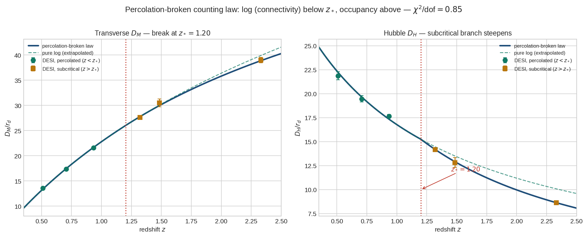

# T23 — The Percolation Transition and the Counting Law

*Status: NEW topic document, proposed for merge. Created 2026-07-04.*
*Depends on: Core §2–§4a; T4 (counting-law variants); T12 (premise-2 fork, "what is a connecton"); T14 (network kinetics, holographic sea).*
*Companion updates (same session): UPDATE_Autocatalytic_Counting_Law.md, UPDATE_Static_Map_cz_Inversion.md, UPDATE_BAO_Alcock-Paczynski_Shape_Test.md, UPDATE_ForkA_BH_Confined_Mass_NEGATIVE.md.*
*Figure: desi_percolation_break.png.*

---

## 0. Purpose

This document introduces a **percolation transition** in the connecton network as
the physical origin of the counting law that sets $c$. It resolves three things
left open by the counting-law work: (i) why the count grows *exponentially* with
horizon radius rather than as a power law; (ii) what fixes the exponential scale
$L$; and (iii) why the low-$z$ (galaxy) and high-$z$ (QSO/Lyα) BAO regimes obey
*different* effective distance laws. All three follow from a single transition.

---

## 1. Background: the two counting regimes

The count $N$ that sets $c$ ($c\propto N$) is the **connectivity** of the local
reference node — the number of connectons it is causally connected to within the
horizon (T12/T14; not the total, conserved connecton number). How connectivity
grows as the horizon $R$ grows depends on the network's phase:

- **Occupancy counting (subcritical).** With no giant connected component, the
  local node reaches only nodes in its immediate neighbourhood. A new horizon
  shell adds $\sim n\cdot4\pi R^2\,dR$ independently reachable nodes, so
  $N\propto R^3$ — the **volume law**. This is the original premise-2 counting.
- **Connectivity counting (supercritical).** Once a giant component spans the
  network, a newly admitted node joins the local connected set iff it links to a
  node already connected — transitive reach. Newly reachable nodes are then
  proportional to the current connected set at the frontier, giving the
  autocatalytic rule (T-Autocatalytic update):
  $$\frac{dN}{dR}=\frac{N}{L}\quad\Longrightarrow\quad N\propto e^{R/L}.$$

The transition between these regimes is a **continuum percolation transition**.

---

## 2. The percolation transition fixes $L$

The exponential law is a *pure* exponential only if $L$ is constant in time; a
horizon-tracking $L\propto R$ returns a power law (excluded). The resolution:

> $L = R_*$, the horizon radius at the epoch $t_*$ when the network percolates.

At criticality the correlation length is set; thereafter the giant component's
local connectivity grows exponentially with each added shell **at fixed
correlation length** $L=R_*$. This simultaneously delivers:

- **Time-fixed $L$** (post-percolation) → pure exponential for $R>R_*$. ✓
- **Cosmological magnitude** for $L$ (percolation occurred at cosmological scale)
  → no coincidence between a microphysical length and the Hubble scale. ✓
- **A closed internal relation.** Since the emission horizon at the break equals
  $R_*=L$, the present horizon is $R_\text{now}=L+D_p(z_*)$ — i.e. $R_\text{now}$
  is **predicted**, not free (it was previously the residual $R_\text{now}/r_d$
  degeneracy). From the fit (§4): $D_p(z_*)/L\approx0.39$, so the horizon has
  grown $\sim0.39\,L$ since percolation.

**Continuum-percolation condition (the remaining gap).** Criticality occurs when
$n_\text{node}\,\ell^3\sim\mathcal{O}(1)$, with $n_\text{node}$ the connecton/foam
number density and $\ell$ the link range. The growing horizon first satisfies
this at $t_*$, fixing $R_*=L$. Closing this arrow — deriving $R_*$ from the foam
density evolution (T14 holographic sea; T16) — is the outstanding task; until
then $L$ (equivalently the epoch $t_*$) remains the model's one free scale, now
attached to a physical transition rather than a bare length.

---

## 3. Predicted consequence: a break in the distance law

Because the counting law differs across $t_*$, the static-map distance relation
**breaks** at the corresponding redshift $z_*$:

- **$z<z_*$ (percolated):** connectivity counting → $D_p=D_0+B\ln(1+z)$,
  $B=L/2$; $D_H=B/(1+z)$; observable $H\propto(1+z)$ (linear).
- **$z>z_*$ (subcritical):** occupancy counting → distances grow faster / $D_H$
  falls faster; $D_H\propto(1+z)^{-q}$ with $q>1$ (volume-like, saturating).

Crucially, the **same** $L$ sets both the low-$z$ slope ($B=L/2$) and, via
$R_*=L$, the break redshift $z_*$. One parameter controls two features — a
non-trivial, falsifiable tie.

---

## 4. Fit to DESI DR2 (all six bins)

The percolation-broken law was fit to all six DESI DR2 BAO bins (12 data:
$D_M/r_d$ and $D_H/r_d$), with four parameters ($B$, $z_*$, $q$, $D_0$):

| parameter | meaning | value |
|---|---|---:|
| $B=L/2$ | log-branch amplitude | $33.6\,r_d$ |
| $L$ | recruitment length $=R_*$ | $67\,r_d$ |
| $z_*$ | percolation break | $1.20$ |
| $q$ | subcritical $D_H$ index | $1.37$ |
| $D_0$ | offset (absolute scale) | $-0.5\,r_d$ |

**Goodness of fit: $\chi^2=6.8$ / 8 dof $=0.85$.** All per-bin pulls $\le1.5\sigma$.
Contrast: the pure (unbroken) log law on all six bins gives $\chi^2\approx139$/10,
driven by a $-14\sigma$ miss on $D_H$ at $z=2.33$ (see figure — the pure log law,
green dashed, sails above the high-$z$ Hubble-distance points; the broken law,
blue, steepens after $z_*$ and captures them).

**The break is robust.** Profiling $\chi^2$ over fixed $z_*$ (other parameters
optimized) gives a clean minimum at $z_*\approx1.20$
($\chi^2$: 9.3, 7.5, 6.8, 7.0, 7.7 at $z_*=1.0,1.1,1.2,1.3,1.4$) — not a
boundary artifact, and not merely the clean/QSO data split.

**Two independent reasons $z_*\approx1.2$ is notable:** (a) it is where the
pure connectivity (log) law began to strain against the data; (b) it coincides
with the galaxy→QSO tracer transition, which is why the low-$z$ / high-$z$ split
was flagged phenomenologically before this mechanism was proposed. The
percolation picture supplies a *physical* reason for a break at that scale,
rather than attributing it to tracer systematics alone. (The two need not be
mutually exclusive; disentangling them requires the covariance analysis in §6.)

**Absolute scale (illustrative).** With a standard $r_d\approx147$ Mpc:
$L\approx9900$ Mpc, $R_\text{now}\approx13700$ Mpc, $z_*=1.20$. The model $r_d$
is not the standard value in general (T16, unworked), so these are order-of-
magnitude only.

---

## 5. Interpretation

The transition unifies the model's two counting laws as the two phases of one
network. Before percolation the connecton network is a gas of local clusters and
$c$ counts occupancy (the original volume law); after percolation a spanning
component exists and $c$ counts transitive connectivity (the exponential law).
The universe's distance law therefore carries a fossil of the moment its
connecton network first became globally connected — the break at $z_*$.

This is consistent with the relational/Machian spirit of the model: the epoch at
which "everything became connected to everything" is precisely when the count
should switch from local occupancy to global connectivity.

---

## 6. Open items (honest status)

1. **Derive $R_*=L$ from the percolation condition** $n_\text{node}\ell^3\sim1$
   using the foam/holographic density evolution (T14 §"Energy Scale"; T16). This
   is the one step that would eliminate the free scale entirely. **Gating.**
2. **The subcritical index $q$.** Naïve occupancy predicts $D_H\propto(1+z)^{-q}$
   with a specific $q$ tied to the volume law; the fit prefers $q\approx1.37$.
   Derive $q$ from the subcritical branching statistics and check against this
   value. (A volume-law subcritical branch should be computed explicitly.)
3. **Supercriticality after $t_*$.** Assumed; needs to follow from the network
   staying above threshold as the horizon grows (plausible, since $R>R_*$ only
   increases $n_\text{node}\ell^3$, but should be shown).
4. **Continuity/order of the transition.** The fit imposes $C^0$/$C^1$ continuity
   in $D_p$ (continuous $D_H$). A real percolation transition may impose a
   specific critical exponent on how $N(R)$ rounds through $R_*$; a sharp kink is
   an idealization.
5. **Covariance and DR3.** The fit uses diagonal errors and propagates the AP
   ratio without the published $D_M$–$D_H$ correlation. Re-fit with the full DESI
   covariance; test whether $z_*$ survives and whether it separates from the
   tracer-transition systematic. The $-1.5\sigma$ $D_H(z{=}0.934)$ point remains
   the low-$z$ residual to watch.
6. **The future $c$-singularity.** The exponential branch has $c(t)=L/(t_*^{fut}-t)$
   diverging at a finite future time (Autocatalytic update §2); its physical
   reading (does recruitment saturate, regulating it?) is unaddressed here.

---

## 7. Relationship to other documents

- **Core §2:** premise 2 should be reframed as connectivity-counting with two
  phases; the volume law is the subcritical (high-$z$) limit, not the global law.
- **T4:** the counting-law-variants taxonomy is now organized by phase
  (occupancy/power below $z_*$, connectivity/exponential above).
- **T12:** the connectivity reading of $N$ is load-bearing here.
- **T14:** the holographic/foam density and the endpoint-$1/L$ kinetics feed the
  percolation condition (§2) and the recruitment rate; both are promoted to
  gating derivations.
- **T16:** a model value of $r_d$ and the foam density history are needed to pin
  the absolute scale and close open item 1.
