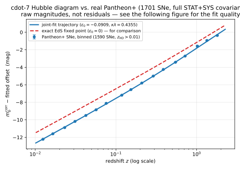
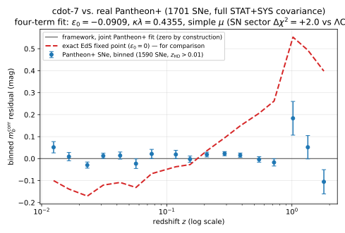
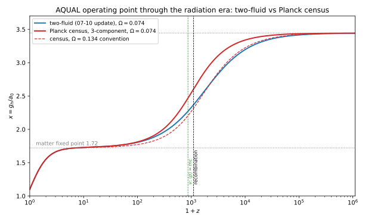
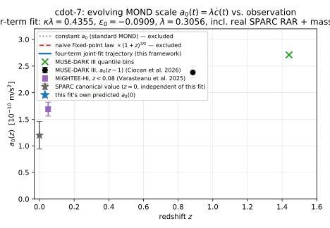

# Foundation — Universal Scaling and AQUAL-Spirit Local Dynamics

*Status: foundational, actively under construction. This is the third premise-set
attempted for this variable-$c$ program (see `ResearchNotes.md` for why the first two
were superseded). This document is self-contained — no cross-references to earlier
iterations. History and cross-references live in `ResearchNotes.md`.*

**Notation table** (fixed 2026-07-07, after a threefold symbol collision was caught —
full account in `ResearchNotes.md` §17): several quantities in this program collide
with standard symbols already load-bearing elsewhere in the same equations. The
resolution adopted throughout this document:

| Symbol here | Meaning | Distinct from |
|---|---|---|
| $\delta(t),\ \delta_0$ | fixed-point deviation (§2.2); invariant amplitude $A_\delta$ | vacuum permittivity $\epsilon_0$ (§3) |
| $\mu(x_0)$ (never bare) | interpolating function at today's operating point | vacuum permeability $\mu_0$ |
| $\lambda$ | AQUAL prefactor, $a_0=\lambda\dot c$ (§4) | photon wavelength, always $\lambda_\gamma$ here |
| $\nu_\text{atom}$ | atomic/clock transition frequency (§3.1) | $\nu_*$ ($\mu$'s log-slope at $x_*$, §2.2) |
| $F_\rho\equiv\rho_0/\rho_b$ | mass-census density ratio (§5.6) | bolometric flux $F$ (§5.5, minor, retained) |

---

## 0. Purpose and Scope

This is a minimal foundation for a physical theory in which the speed of light $c$ is
not a universal constant but a cosmologically-determined quantity, sourced by the mass
enclosed within an observer's horizon, and in which *all* local physics is invariant in
Planck units — only $c(t)$ itself carries cosmological time-dependence. Local
gravitational dynamics is modified at low acceleration in the spirit of Bekenstein &
Milgrom's AQUAL, with the modification's characteristic acceleration scale tied to the
same cosmological quantity. The goal remains a framework capable of producing MOND-like
dynamics (flat rotation curves, the radial acceleration relation, the M-σ relation) and
late-time cosmic acceleration without separate dark-matter or dark-energy sectors.
**This "no dark matter" claim is currently conditional, not settled**: §5.6's four-term
fit against real data (Pantheon+, local RAR, and published $a_0(z)$ measurements) finds
the cosmological closure demands a mass density that closes against the directly
measured baryon content *only* if relic neutrinos sit at essentially the current
laboratory mass bound ($\Sigma m_\nu\approx1.37$ eV, right at KATRIN's edge) — a real,
quantified, externally time-limited escape, not a comfortable one. This is stated here,
in the opening scope statement, rather than left for §5.6 alone to carry, because it
bears directly on the document's central claim. **Stated plainly rather than left for a
reader to name first: at that mass, the closure's "no dark matter" claim survives only
by admitting roughly 40% of its matter budget as hot dark matter in classical-frame
language** (three quasi-degenerate neutrinos at $\approx0.46$ eV each) — a materially
weaker claim than "no dark matter at all," and one inheriting hot-dark-matter's own
historical exposure on structure formation (free-streaming erasure of small-scale
power), a test this framework cannot yet pose (§0's radiation-era scope limit below;
§6 item 5).

**Scope reduction from earlier attempts, stated plainly.** This document does not
attempt to reproduce General Relativity's relativistic predictions (light deflection,
perihelion advance) exactly. That was a feature of an earlier, now-superseded local
closure; the mechanism adopted here is explicitly Newtonian-level, matching the AQUAL
program it draws from. A relativistic completion, if one is needed, is future work
(§6 item 7).

**Scope limit, partially lifted.** The Machian closure (§2) originally sourced $c(t)$
from rest mass only, making every result in this document a **late-universe result**
($z\ll z_\text{eq}$). §2.4 now extends the closure through matter-radiation equality
and recombination out to $z\sim10^6$, using the **Planck-unit census** (§2.1) as the
counting law — a genuinely dimensionless inventory that reduces to particle-counting
for matter (via premise 3) and *forces* a relativistic neutrino term with no new
freedom. This lifts the scope limit for **background history only**: the trajectory
$x(z)=g_h(z)/a_0(z)$ through recombination, and the location of this framework's own
$z_\text{eq}$ analog, are now computed and checked against the four-term fit's own
mass budget (§2.4, §5.6). It does **not** touch the perturbation/structure sector —
no acoustic oscillations, no CMB anisotropies, no BAO (§6 item 6, still explicitly
gated by this project's own cdot-4/cdot-5 history) — nor does it yet include
$e^+e^-$ annihilation or the QCD transition ($z\gtrsim10^9$). Everything through
recombination is a smooth trajectory with a quantified kink, not an oscillation in
one.

**A deliberate scope boundary, stated as a standing test for what belongs in this
document.** Premise 2's homogeneity assumption and premise 4's local application of
$a_0$ to arbitrarily clumped, structured systems are not in tension — they do different
jobs. Homogeneity is used *only* to compute the single background number $a_0(t)$ from
the horizon-scale closure; premise 4 then imports that number as an external constant
into ordinary, local equilibrium dynamics, exactly as standard MOND uses $a_0$,
regardless of how anisotropic the local mass distribution is. RAR, BTFR, and M-σ (§5.7)
are consequently all **equilibrium-dynamics tests of already-formed, virialized
systems**: each takes $a_0(z)$ as given and asks how one system's internal dynamics
respond to it. This is categorically different from asking how density perturbations
*grow* into structure in the first place, which requires cosmological perturbation
theory built on the homogeneous background — exactly the territory (BAO, CMB
anisotropies) that has broken every prior iteration of this project and is deliberately
deferred (§6 items 5–6). The standing test for any future addition to this section:
*does the calculation take $a_0$ as an already-existing external input, or does it need
to explain how structure grew?* Only the former belongs here until the radiation-era
and perturbation sectors are built.

**The framework's falsifiable content is now localized.** A running theme of this
document's own consistency checks (§3, §5.5) is that essentially every locally
calibrated quantity — atomic clocks, standard candles, rulers — turns out to be exactly
invariant across cosmic epochs once measured in its own local units. The precise
statement:

> **Local physics is Planck-unit invariant, except through a single portal: the
> acceleration scale $a_0(t)=\lambda\dot c(t)$ entering AQUAL's interpolating
> function (§4).**

Everything else — the photon sector, the flux/luminosity sector, standard candles — has
been shown (not assumed) to be a change of description relative to an ordinary
expanding, constant-$c$ picture. This sharpens the methodological note below: the
correspondence is not merely assumed to exist in the abstract; it has been **partially
constructed**.

**A methodological note on scope — partially constructed, not merely assumed.** Earlier
versions of this document treated the canonical correspondence between this description
and an ordinary expanding, constant-$c$ one as a pure working assumption. It no longer
is, in two places: (i) the *photon sector* (§3.3, §5.5) maps exactly onto the
Einstein–de Sitter ($\Omega_m=1$) comoving-frame description — every purely photometric
or geometric observable computed so far (redshift, time dilation, luminosity distance,
angular-diameter distance, Tolman dimming, distance duality, blackbody thermodynamics)
coincides exactly with EdS; (ii) the *asymptotic future* (§2.2) maps onto a de Sitter
phase. The remaining, genuinely open question this correspondence answers in standard
terms is: **what is this framework's analog of $\Lambda$?** §2.2 answers it — an
instability of the naive (EdS-equivalent) history, not a constant — but the mechanism
behind its one free parameter is not yet known (§6 item 3). The point of building this
framework's own internal consistency requirements has been vindicated in one respect:
the search for "what standard cosmology is missing" led directly to a concrete,
checkable candidate mechanism, not merely a restatement of the problem.

This document commits to three premises (§1–§3) and one adopted (not derived) dynamical
postulate (§4), and derives their consequences. Every quantity that is *adopted* rather
than *derived* is flagged as such at the point it is introduced.

---

## 1. Premise 1 — The Geometric Arena: Static Euclidean Space, Independent Time

Space is ordinary, static, flat Euclidean 3-space. Time is an independent, Newtonian-style
parameter, not a fourth coordinate mixed with space by a metric. Nothing expands; nothing
curves. Every dynamical effect that might otherwise be attributed to spatial expansion or
spacetime curvature must instead be attributed to position- or time-dependence of
physical quantities — the speed of light foremost among them, per premise 2. This is a
convenient, physically legitimate choice of description, not an assertion that
expanding-spacetime descriptions are wrong: it is one self-consistent way to organize the
same physics, and (unlike an earlier attempt built on reproducing General Relativity's
curved-spacetime predictions exactly) this framework's own dynamical postulate is native
to flat space — Bekenstein & Milgrom's AQUAL, which this framework draws its local
dynamics from, is itself a modification of ordinary Newtonian gravity in Euclidean space.

A direct kinematic consequence, used throughout §3: in this static, spatially homogeneous
space, a light signal's wave crests all move at the *same* instantaneous $c(t)$ — there is
no position-dependence for them to move differently across. Crest spacing (wavelength)
therefore cannot change during flight; only $c(t)$'s own time-dependence, which is common
to every crest, can. This single fact is what forces §3.3's redshift law and rules out
the alternative once tried and abandoned (`ResearchNotes.md` §6).

---

## 2. Premise 2 — The Cosmological Machian Closure

The speed of light's cosmological value is set by the mass enclosed within the observer's
own horizon, in the Machian sense: $c$ is not fixed externally but is mutually consistent
with the horizon mass and radius that themselves depend on $c$'s history — and, as this
section now shows, with premise 4's modification of gravity, since the horizon's own
binding acceleration turns out not to be safely in the Newtonian regime.

### 2.1 Horizon and enclosed mass — Machian by number

The horizon grows at the local light speed: $\dot R_h=c(t)$, equivalently, in integral
form, $R_h(t)=\int_{-\infty}^t c(t')\,dt'$ — the accumulated light-travel distance since
genesis. The two forms are the same statement (fundamental theorem of calculus), not
separate claims.

**Mass conservation is stated at the level of particle number, not mass density —
this is a decision, not the only reading available (§6 item 4 records why).** Particle
number density $n$ is homogeneous and constant (assumed, not derived — §6 item 9): the
enclosed particle count is $N_h(t)=\frac43\pi R_h(t)^3 n$. Combined with premise 3's
universal mass law, the enclosed *rest mass* is
$$M_h(t) = N_h(t)\,m(t) = \frac43\pi R_h(t)^3\, n\, m_0\!\left(\frac{c(t)}{c_0}\right)^{1/2} = \frac43\pi R_h(t)^3\,\rho_0\!\left(\frac{c(t)}{c_0}\right)^{1/2},$$
where $\rho_0\equiv nm_0$ is today's rest-mass density. This counts rest mass only —
radiation energy is not yet included (§0's scope limit; §6 item 5).

**Restated as a single counting principle: the Planck-unit census.** The paragraph
above counts massive particles; extended to the radiation era (§2.4), the natural
generalization is a genuinely dimensionless inventory of *everything* within the
horizon, measured in the instantaneous Planck unit:
$$\mathcal N(t)\;\equiv\;\sum_{i\,\in\,R_h}\frac{E_i(t)}{E_P(t)},\qquad
M_h(t)\;\equiv\;\mathcal N(t)\,m_P(t),\qquad E_P\equiv\sqrt{\frac{\hbar c^5}{G}},\quad
m_P\equiv\sqrt{\frac{\hbar c}{G}}.$$
**This is not a new assumption layered on top of the paragraph above — it is
arithmetically identical to it, term by term, for matter.** Since $E_P=m_Pc^2$
exactly, a massive particle's census weight is $E_i/E_P=m_i/m_P=\sqrt{\alpha_{G,i}}$
— **epoch-invariant by premise 3** ($\alpha_G$-invariance, §3) — so $\mathcal N m_P$
reduces exactly to $\sum m_i$, and "just counting mass" is not a separate simplifying
choice but the matter-only special case of this same census, forced by the identical
symmetry that fixes $s=+\tfrac12$ (§3.4): **the counting law is the Machian face of
Planck-unit invariance** (§6 item 4 now carries both debts as one). For a photon,
$E_\gamma/E_P=\hbar kc/E_P\propto c^{-3/2}$ relative to matter's constant weight —
this is exactly §2.4's radiation term, derived there directly; the census is
introduced here because it is the principle underlying both the matter-only count
above and the radiation extension, not a change to either.

### 2.2 The working closure: an AQUAL-consistent dynamical system

**The naive Newtonian closure is inconsistent with premise 4, at its own operating
point.** The Sciama-type relation $c^2\propto GM_h/R_h$ (used in an earlier pass through
this derivation) implicitly assumes Newtonian gravity — but the horizon's own binding
acceleration, $g_h\equiv c^2/R_h$, turns out (self-consistently, below) to sit only a
factor of a few above $a_0$: squarely in AQUAL's transition regime, where premise 4
says Newtonian gravity does *not* apply. Premises 2 and 4, taken together with the
Newtonian closure, contradict each other at the closure's own operating point. The
repair is mandatory, not optional, and — as it turns out — supplies the mechanism this
framework was missing for late-time cosmic acceleration.

**The corrected closure.** For spherical symmetry, AQUAL's field equation integrates
exactly (Bekenstein–Milgrom) to $\mu(g_h/a_0)\,g_h=GM_h/R_h^2$. The Machian relation is
taken as
$$c^2=\kappa\,g_h R_h,$$
the field-based binding, reducing to the old Sciama form when $\mu\to1$. (An alternative
— $c^2\propto$ the AQUAL *potential* directly — was considered and rejected: the
deep-MOND potential $\sqrt{GMa_0}\ln(R/R_\text{ref})$ carries an arbitrary reference
scale, and importing $R_\text{ref}$ would smuggle in exactly the free constant this
construction is trying to explain. The field-based form is reference-free.) Using
$a_0=\lambda\dot c$ (§4) and §2.1's $M_h(t)$, eliminating $g_h$ gives the closed,
autonomous system
$$\dot R_h=c,\qquad \dot c=\frac{c^2}{\kappa\lambda\,x\,R_h},\qquad x=\mu^{-1}\!\left(\frac{R_h^2}{B^2c^{3/2}}\right),$$
for a constant $B$ fixed by $G,\rho_0,c_0,\kappa$. Because $a_0$ involves $\dot c$, this
is a genuine two-dimensional dynamical system — one integration constant beyond the old
algebraic closure. $\kappa$ and $\lambda$ enter every result only through the combination
$\tilde\lambda\equiv\kappa\lambda$; $\kappa=1$ is assumed for the numerics below, with the
resulting $O(1)$ ignorance carried explicitly (§5.5).

**The fixed point: the earlier, simpler closure survives as a special solution.** The
scale-free ansatz $x=\text{const}$ solves the system with $R_h\propto c^{3/4}$ — the
same power-law history derived in an earlier pass — with the operating point fixed at
$$x_*=\frac{3}{4\kappa\lambda}.$$
Every result derived from the pure power-law closure (§3.3's redshift law, §5.5's exact
Einstein–de Sitter photometry) holds *on this fixed point*, for any $\mu$ and any
$\lambda$. **This closure choice does not derive $\lambda$**: the fixed point exists for
every value of $\lambda$, so the earlier hope that self-consistency would pin it down is
recorded here as dead (`ResearchNotes.md` §8).

**The fixed point is unstable — and that instability is this framework's analog of
$\Lambda$.** Linearizing $R_h=B\sqrt{\mu_*}\,c^{3/4}(1+\delta)$:
$$\dot\delta=\frac{3}{2\nu_*}\frac{\dot c}{c}\,\delta,\qquad
\nu_*\equiv\left.\frac{d\ln\mu}{d\ln x}\right|_{x_*}\in(0,1)
\quad\Longrightarrow\quad
\delta(z)=\delta_0\,(1+z)^{-1/\nu_*}.$$
Deviations from the scale-free history are negligible in the past and grow at late
times — exactly $\Lambda$'s characteristic phenomenology, produced here by an
instability rather than a constant. The sign of the one new integration constant
$\delta_0$ sets the branch: $\delta_0<0$ (the horizon sliding *below*
scale-free growth, into the deep-MOND regime) gives late-time acceleration and an older
universe. Cosmography, using the redshift law of §3.3: $q_0=(4-2j)/3$ with
$j\equiv c\ddot c/\dot c^2$; the fixed point gives $j=\tfrac54,\ q_0=+\tfrac12$
(consistent with the EdS correspondence, §5.5), and at linear order
$q_0=\tfrac12+\delta_0(\nu_*+2)/\nu_*^2$.

**What $\delta_0$ is, precisely — initial data, not a law parameter.** The Newtonian-era
closure (an earlier pass through this document) was algebraic and rigid, a
zero-parameter history; promoting it to the dynamical system above added exactly one
genuine integration constant. $\delta_0$ is the coordinate labeling *which* member of
the resulting one-parameter trajectory family our universe sits on — the premises,
$\mu$, $\lambda$, $\kappa$ are all trajectory-independent, so this is data about our
particular history, not physics. Its epistemic slot is exactly that of $\Omega_\Lambda$
or the primordial amplitude $A_s$ in standard cosmology: a measured constant, not yet
explained by a generation mechanism (§6 item 3). Because "the deviation today" is
epoch-dependent bookkeeping, the epoch-independent label is the growing-mode amplitude
$$A_\delta\equiv\delta(t)\left[\frac{c(t)}{c_0}\right]^{-3/2\nu_*}\qquad(\text{constant
along the trajectory, linear regime}),$$
and any quoted "seed value" of the deviation must state its reference epoch — the
$\delta_0$ values quoted throughout this document are specifically today's value,
$A_\delta$ at $z=0$.

**The fixed point is a separatrix, and the observed sign is derived from global
regularity, not merely fitted.** The two branches are not symmetric. **$\delta<0$**
(deep-MOND-ward, the observed branch): globally regular, extending for infinite proper
time into the exponential-$c$, de Sitter-analog future (above). **$\delta>0$**
(Newtonian-ward): along the flow,
$$\frac{\dot\mu}{\mu}=\frac{2a}{r}\left(1-\frac{x_*}{x}\right)\ \longrightarrow\ \frac{2a}{r}>0\quad\text{as }x\to\infty$$
(bounded away from zero, using $d\ln\mu/dt=d\ln[\mu_*r^2a^{-3/2}]/dt$ and $x_*=3/(4\kappa\lambda)$),
so $x$ diverges — $\mu$ approaches its asymptote $1$ — in *finite* coordinate time, at
which point the Machian condition $\mu(x)g_h=GM_h/R_h^2$ has no continuation: the
horizon's implied Newtonian binding exceeds what any admissible interpolating function
can supply. **Checked directly, not merely derived**: forward integration of the exact
dynamical system above, for both interpolating-function forms this document considers
(`simple`, `standard`), confirms a genuine finite-coordinate-time breakdown for every
$\delta_0>0$ trial at the perturbative scale checked, with $R_h,c$ still finite at the
point $\mu\to1$ — so the proper time to it is finite too, unlike the $\delta<0$ branch's
own forward singularity (above), whose proper time diverges. Only $\delta<0$
trajectories persist indefinitely: **the observed sign is therefore forced by global
regularity, reducing the constant's remaining initial-data content to a single positive
amplitude, $|\delta_0|$** — flagged, not yet promoted further, since the check was run
at perturbative $\delta_0$ and did not exhaustively map every interpolating function or
amplitude (`ResearchNotes.md` §17, `Fable-1/separatrix_check.py`).

**First pass against real data: SN + $a_0(z)$ only, $\kappa=1$.** Fit jointly against
the actual Pantheon+ compilation (1701 SNe, full published STAT+SYS covariance,
$z_\text{HD}>0.01$ cut leaving 1590 SNe, absolute-magnitude/$H_0$ offset analytically
marginalized so only the shape is tested) and the published $a_0(z)$ constraints (§5.5),
with $\kappa=1$ (simple interpolating function): $\delta_0=-0.0678$,
$\kappa\lambda=0.307$, $q_0=-0.56$, age $=12.8$ Gyr. The pipeline was validated first:
run on flat $\Lambda$CDM alone, it returns $\Omega_m=0.331\pm0.018$, $\chi^2=1403.7$ —
reproducing the published Pantheon+ SN-only result ($0.334\pm0.018$) to a third of a
sigma. At this joint best fit, the SN shape costs only $\Delta\chi^2_\text{SN}=+1.6$
relative to that $\Lambda$CDM fit, while the $a_0(z)$ sector is described at
$\chi^2=6.5$ for four constraints, against $\chi^2=20.0$ for the best *free linear*
$a_0(z)$ law. This result is superseded by the four-term fit below, which folds in two
more real datasets rather than leaving them for later.

**The decisive four-term fit: adding the real local RAR shape and the mass census.**
Extending the same trajectory machinery with two more likelihoods — the actual SPARC
radial-acceleration-relation data (McGaugh, Lelli & Schombert 2016, *PRL* 117, 201101;
2693 points from 153 galaxies, downloaded directly, not a summary statistic) and the
mass-census term of §5.6, with $\Sigma m_\nu$ a bounded nuisance parameter — and fitting
$(\delta_0,\kappa\lambda,\lambda,\Sigma m_\nu)$ jointly gives, for the simple
interpolating function (still preferred over the standard one, $\Delta\chi^2\approx13$):
$$\delta_0=-0.0909,\quad\kappa\lambda=0.4355,\quad\lambda=0.3056\ (\kappa\approx1.43),
\quad\Sigma m_\nu=1.374\ \text{eV},$$
giving $a_0(0)=1.39\times10^{-10}$ m/s², $q_0=-0.44$, age $=12.9$ Gyr. This is now the
framework's working cosmology, superseding the SN+$a_0(z)$-only numbers above. **Validated
before being trusted**: switching the two new terms off exactly reproduces the SN+$a_0(z)$
result above (to numerical precision); the optimum is identical from four widely
different starting points (a genuine minimum, not an artifact); an intermediate sign
error of the author's own ($a_0=\lambda\dot c_0$ requires the coefficient $\tfrac23$,
not $\tfrac32$) was caught by the first check failing and fixed before any number below
was trusted. Full breakdown, and what the $\Sigma m_\nu=1.374$ eV finding actually means,
is in §5.6 — it is the single most consequential number this fit produces. (Reproduced
end-to-end by `four_term_fit.py`, archived with `ResearchNotes.md` §14.)

**A caveat that matters as much as the headline number.** RAR data alone prefers
$a_0\approx1.26\times10^{-10}$ m/s² — lower than the joint fit's $1.39$. Forcing
$\lambda$ to RAR's own preference costs $\Delta\chi^2=+13.4$; the RAR sector's own
excess at the joint optimum over its unconstrained best is $+7.0$. The four sectors
(SN shape, $a_0(z)$ evolution, local RAR, mass census) are not in perfect mutual
agreement — a real, quantified tension, not hidden by quoting only the best-fit point.
This fit is also a **point estimate, not a posterior** (no MCMC yet), and RAR's 2693
points are treated as statistically independent when they are not (multiple radii per
galaxy share systematics) — downweighted by the point-to-galaxy ratio ($\approx17.6$)
as an approximate correction, not a full per-galaxy covariance treatment. $H_0$ remains
fixed at 70 km/s/Mpc throughout, not fit.

The standard interpolating function fits distinctly worse once the $a_0$ sector is
included ($\Delta\chi^2=42$ at the SN+$a_0(z)$ level, $\approx13$ once RAR and the mass
census are added too) — on the SN data alone the two $\mu$-forms are nearly degenerate,
so it is the $a_0$-sector and RAR data, not the SN shape by itself, that discriminates
$\mu$ (§6 item 8). The history is EdS to within a fraction of a percent before $z\sim5$
and departs recently; today's operating point has slid from $x_*=1.72$ to $x_0\approx1.10$.

*Figure: the raw Hubble diagram (four-term fit) — real Pantheon+ magnitudes (binned) and
both model curves together, before looking at residuals. The joint-fit trajectory and
the exact-EdS fixed point are visually close over most of the range; the next figure
shows where and by how much they actually differ. Generated by `cdot-7/make_figures.py`,
built on `four_term_fit.py`'s trajectory.*

*Figure: the same comparison in residual form — binned differences against the real
Pantheon+ compilation (1701 SNe, full covariance), not a smooth proxy curve. The
framework's four-term fit (zero line, by construction of the fit) tracks the data at
$\Delta\chi^2=+2.0$ (SN sector) relative to $\Lambda$CDM; the exact-EdS fixed point (dashed)
diverges at high $z$, reproducing EdS's own well-known SN Ia failure — the divergence
visible here is easy to miss in the raw magnitudes above. Generated by
`cdot-7/make_figures.py`, built on `joint_fit.py`.*

**Genesis is unaffected; the asymptotic future is a de Sitter phase.** With lookback
time $w\equiv t_0-t>0$, the backward attractor to $c\to0$ as $w\to\infty$ survives from
the earlier, simpler closure — genesis is not sensitive to this repair. Forward in time,
the trajectory runs away into deep MOND, with $c$ diverging at a *finite coordinate
time* $t_*$ as $c\propto(t_*-t)^{-2/5}$, but the *proper* time needed to reach it
diverges — now only logarithmically ($\Delta\tau_\text{proper}\propto\ln[1/(t_*-t)]$,
numerically $\approx16$ Gyr of proper time per decade of $c$, i.e. $c$ grows
exponentially in proper time with an e-fold time close to $\Lambda$CDM's own de Sitter
rate, $1/(\sqrt{\Omega_\Lambda}H_0)$). A clock never reaches the coordinate singularity —
the genesis-mirror structure (finite coordinate time, infinite proper time) survives,
weakened from power-law to logarithmic. The correspondence of this document's
methodological note therefore extends to the future as well as the past: the deep-MOND
runaway maps onto a de Sitter phase.

**$H_0^\text{hor}$ is an instantaneous rate, and today's $a_0$ is trajectory-invariant.**
$H_0^\text{hor}\equiv(\dot c/c)|_{t_0}$ (not a global ratio $c_0/R_{h,0}$, which held only
under the earlier, simpler closure). Exactly on *any* trajectory of this dynamical
system, $H_0^\text{obs}=\tfrac32\dot c_0/c_0$ (§5.5), so today's $a_0=\lambda\dot
c_0=\tfrac23\lambda c_0H_0^\text{obs}$ regardless of $\delta_0$ — the calibration of
§4 survives this section's closure rebuild untouched.

### 2.3 $c_0$ and $c_z$ are relational, not measured

Under the SI convention (the second fixed by an atomic-transition cycle count, the metre
fixed as a fraction of a light-second), $c$'s numerical value is a tautology: any
observer, at any epoch, calibrating units the same way gets the identical number, always.
**$c_0$ and $c_z$ denote a cross-epoch relational quantity, not an instrument reading** —
the same role redshift $z$ itself plays: $z$ compares a received photon's fixed frequency
against the *receiving* observer's own local reference, not a universal standard, so two
observers at different epochs intercepting the same photons infer different $z$, not
because the photons changed or either observer's own $c$ reads differently on their own
instruments, but because the local reference each compares against differs.

### 2.4 Extending the closure to the radiation era

**Scope, stated first.** This section extends §2.2's closure with a radiation term and
a census-forced neutrino term, checked numerically from today through matter-radiation
equality and recombination out to $z\sim10^6$. It is **background-history only**: a
smooth trajectory and where it kinks, not a coupled photon-baryon fluid's acoustic
oscillations. The perturbation/structure sector (§6 item 6) remains untouched and
explicitly gated, for the reasons already stated there.

**The radiation term's coordinate scaling.** The census of §2.1 gives each photon's
weight $E_\gamma/E_P=\hbar kc(t)/E_P(t)\propto c(t)^{-3/2}$ (conserved coordinate
wavenumber $k$, §3.3's Noether argument; $E_P\propto c^{5/2}$) — equivalently, since
every photon present at time $t$ has coordinate energy $\propto c(t)$ regardless of
emission time, $u_\gamma(t)\propto c(t)^{+1}$ and $\rho_\gamma^\text{eff}(t)\equiv
u_\gamma(t)/c(t)^2\propto c(t)^{-1}$ — the **opposite sign** from matter's
$\rho_m\propto c^{+1/2}$. Toward genesis ($c\to0$) matter's contribution vanishes while
radiation's diverges, so a crossover epoch — this framework's own analog of
$z_\text{eq}$ — must exist. **Cross-checked independently**: a general
coordinate$\to$local dictionary (built from §3.1's local length $\propto c^{-3/2}$ and
frequency $\propto c^{5/2}$ scalings: a coordinate density $\propto c^p$ maps to a local
density $\propto c^{p-7}$) applied to $u_\gamma\propto c^1$ predicts
$\hat u_\gamma\propto(1+z)^4$ — matching §5.5's already-established result exactly —
and applied to $\rho_mc^2\propto c^{5/2}$ predicts $\hat\rho_m\propto(1+z)^3$, the
standard matter-dilution law, not previously stated in this document. Two independent
hits on exponents not fitted to produce them.

**The sourcing prefactor: no pressure term.** Radiation sources the AQUAL closure as
$\rho_\gamma^\text{eff}=u_\gamma/c^2$, not the GR-motivated $\rho+3p/c^2=2u_\gamma/c^2$
a $w=\tfrac13$ fluid carries in the Friedmann equations. This is not a simplifying
choice: AQUAL's field equation (premise 4) is a literal, non-relativistic Poisson
equation, $\nabla^2\Phi=4\pi G\rho$ in the $\mu\to1$ limit, sourced by mass density
alone — it has no structure to express a pressure term, which is a feature of GR's
field equations specifically (visible already in GR's weak-field Tolman-mass limit,
not only the cosmological acceleration equation). No internal conservation law forces a
value here either (the Bianchi-identity route that fixes this in standard cosmology
needs an expanding volume doing work against pressure, with no analog under premise 1's
static space). **Adopted as $\eta=1$**, the value actually licensed by what premise 4
says as written — revisit only if a relativistic completion (§6 item 7) is ever built.
The census (§2.1) makes this principled rather than merely scope-argued: an inventory
has no pressure term to express in the first place.

**The extended closure and its two fixed points.** With
$\rho_\text{tot}(c)=\rho_0(c/c_0)^{1/2}+\rho_{\gamma,0}(c/c_0)^{-1}$ (plus the neutrino
term below), §2.2's argument becomes a sum of differently-scaling terms, so its
$x=$const solution survives only as an asymptote on either side. Repeating §2.2's own
method for a general source $\rho\propto c^n$: kinematics ($\dot R_h=c$) force
$R_h\propto c^{1-n/2}$, and matching against the closure's own $\dot c$ pins
$$x_*(n)=\frac{1-n/2}{\kappa\lambda},$$
independent of $\mu$'s functional form. Matter ($n=\tfrac12$) reproduces §2.2's
$x_*=3/(4\kappa\lambda)$ exactly (validation). Radiation ($n=-1$) gives a **second
fixed point**,
$$x_*^{(\text{rad})}=\frac{3}{2\kappa\lambda}=2\,x_*^{(\text{matter})},$$
exactly double, also $\mu$-independent. Using the four-term fit's $\kappa\lambda=
0.4355$: $x_*^\text{(matter)}=1.72$ (as in §2.2), $x_*^\text{(rad)}=3.44$ — still
squarely in AQUAL's transition zone, not deep-Newtonian. **This framework's own
self-similar structure means the early universe does not automatically simplify the
way it does in standard cosmology**: $a_0=\lambda\dot c$ is tied to the same
self-similar solution as $g_h$, so $g_h/a_0$ need not grow large just because $c$ is
small.

**The neutrino term, forced by the census with zero free functions.** Premise 1's
Noether argument conserves each relic neutrino's coordinate wavenumber $k$ exactly as
it does for photons; premise 3 gives $m_\nu(t)\propto c^{1/2}$. The census weight per
neutrino is therefore
$$w_\nu=\frac1{c^2}\sqrt{\big(m_\nu(t)c(t)^2\big)^2+\big(\hbar k\,c(t)\big)^2},$$
interpolating between census-radiation ($\propto c^{-1}$, deep past) and census-matter
($\propto c^{+1/2}$, today), with the transition where $\hbar k\approx m_\nu c$.
Translated to local units, this is exactly the standard relativistic Fermi–Dirac
energy density of massive relic neutrinos ($\hat p\propto(1+z)$, $\hat m$ const, frozen
occupation) — the genuine third term a two-fluid treatment lacks, derived here with no
new free parameter. **Verified numerically**: with the four-term fit's own
$\Sigma m_\nu=1.374$ eV (§5.6, three quasi-degenerate states at $0.458$ eV),
$$\Omega_\nu^\text{census}(t_0)=0.0298,\qquad\Omega_b+\Omega_\nu^\text{census}=0.0740,$$
matching the closure's demanded $\Omega_\text{closure}=0.074$ to $0.1\%$ — the exact
FD treatment closes the four-term fit's mass census without any adjustment to
$\Sigma m_\nu$ (the naive $\Sigma m_\nu/(93.14h^2)$ estimate used in §5.6 differs from
the exact value by $\sim1\%$; both close the budget).

**The crossover and the trajectory, integrated through it.** Setting the census
radiation-like and matter-like components equal gives, at the current working
convention ($\Omega_\text{closure}=0.074$), a crossover at $z\approx1080$ —
essentially *at* recombination — versus $z\approx1466$ for the simpler two-fluid
(matter+photon only) treatment; across all four standing $\Omega_\text{closure}$
conventions (§6 item 1, §5.6), the crossover ranges over $z\approx870$–$2650$.
Integrating the full three-component system backward from today's actual operating
point ($x_0=1.10$, §5.5/§5.6) to $z\sim10^6$: **the census and two-fluid trajectories
agree to 4 digits for $z\le10$ (identical, since neutrinos are fully non-relativistic
there — every late-time result in this document, including the four-term fit itself,
is untouched), diverge by $<1\%$ below $z\approx190$, and depart systematically above
it**, with both fixed points ($1.72$, $3.44$) exactly unchanged in either treatment
(neutrinos asymptote to census-radiation in the deep past). **At recombination
($z=1100$), $x=2.61$ at the primary convention** ($[2.32,2.61]$ across all four
conventions; $2.67$ under the standard, not simple, interpolating function) — roughly
$50\%$ above the matter-only fixed point, and a systematic $\sim10\%$ above the
simpler two-fluid estimate ($[2.14,2.37]$). At $z=1100$ the neutrinos are genuinely
mid-transition ($40\%$ of their census energy is kinetic). **Any future treatment of
recombination-era dynamics in this framework should use this census value, not
$x_*=1.72$.**

*Figure: the AQUAL operating point $x=g_h/a_0$ through the radiation era. The
three-component Planck-unit census (solid red, $\Omega_\text{closure}=0.074$) departs
above the simpler two-fluid treatment (blue) before recombination, converging with it
at both ends (matter fixed point $1.72$, past; radiation fixed point $3.44$, future).
Dashed red shows the $\Omega_\text{closure}=0.134$ convention for comparison.
Generated by `Radiation-1/census_closure.py`, independently re-run before merging.*

**What this does not yet do.** Coordinate photon-number conservation (used above to
derive $u_\gamma\propto c$) is not itself the deepest statement available — §2.1's
census reframes it as census continuity through energy-conserving conversions, which
is weaker and more defensible (per-species number conservation is known false at
$e^+e^-$ annihilation and other particle-creating processes; census continuity is not).
$e^+e^-$ annihilation and the QCD transition are real, sized kinks confirmed to require
**no correction to anything computed here** (standard entropy-transfer bookkeeping
puts $e^+e^-$ at $1+z\approx2.2\times10^9$, boosting $u_\gamma$ by
$(11/4)^{4/3}\approx3.85\times$ relative to naive extrapolation — far past everything
tested above) but are not themselves computed in census form (§6 item 5). The
census-continuity assumption itself rests on instantaneous coordinate-frame energy
conservation at conversions — plausible given premise 3, but an assumption, on §6 item
10's desk, not smuggled in. Full derivation trail, caveats, and the two-session history
(a first two-fluid pass, then the census refinement) are in `ResearchNotes.md` §19–20.

---

## 3. Premise 3 — Planck-Unit Invariance

**Adopted, not derived, but now stated as a single principle rather than two
independent scaling laws.**

> **Planck-unit invariance.** All local physics — every dimensionless coupling
> ($\alpha$, the gravitational fine-structure constant $\alpha_G=Gm^2/\hbar c$, mass
> ratios, and by extension the strong and weak sectors) — is epoch-invariant. Only
> $c(t)$ carries cosmological time-dependence. The conventional choice of which
> dimensionful constants to hold fixed ($G,\hbar,e$) is a units convention, not physics.

Given $G,\hbar$ fixed by this convention, $\alpha_G$-invariance forces a *unique* mass
exponent:
$$m(t) = m_0\left(\frac{c(t)}{c_0}\right)^{1/2}\qquad(\text{equivalently: }m_\text{Pl}\propto c^{1/2}\text{, so "all mass is constant in Planck units"}),$$
exactly, with no exceptions and no position-dependence (unlike an earlier, now-abandoned
attempt at a *local*, position-dependent mass law — `ResearchNotes.md` §2). Newton's
constant $G$ is exactly invariant: $G(t)=G_0$. Given $e,\hbar$ fixed, $\alpha$-invariance
forces the vacuum permittivity $\epsilon_0\propto c^{-1}$ by the identical move (the
Planck charge $q_\text{Pl}=\sqrt{4\pi\epsilon_0\hbar c}$; $e/q_\text{Pl}=\sqrt\alpha$
invariant iff $\epsilon_0\propto c^{-1}$). **What was an unresolved tension in an
earlier pass through this document ("all local physics scales the same way" is false as
dimensionful powers, since $m\propto c^{1/2}$ but $\epsilon_0\propto c^{-1}$) dissolves
here**: the correct statement was never about a shared dimensionful power — it is that
all *dimensionless* physics is invariant, and different dimensionful quantities
necessarily carry different powers of $c$ as a result.

This principle is a postulate, checked below against high-precision data (§5) and
retro-explains several results derived independently before it was identified (the
exact LLR cancellation, §5.1; the exact-standard SN candle, §5.5) — providing them a
common cause rather than merely surviving them. What remains owed is a *mechanism* for
the invariance itself (§6 item 4) — the normal epistemic status of a symmetry
principle, and a better standing debt than an unexplained numerical coincidence, but a
debt nonetheless. **A predictive consequence at zero further cost**: zero drift in
$\alpha$, in $\mu=m_p/m_e$, or in any laboratory dimensionless constant, at every epoch
— trivially satisfied where a generic varying-$c$ proposal would need to tune.

### 3.1 Immediate consequence: atomic scales

The Bohr radius $a_\text{Bohr}\propto\epsilon_0/m_e\propto c^{-1}\cdot c^{-1/2}=c^{-3/2}$.
The Rydberg-type atomic transition frequency $\nu_\text{atom}\propto m_e\epsilon_0^{-2}\propto
c^{1/2}\cdot c^2=c^{5/2}$.

### 3.2 Immediate consequence: orbital dynamics

For a two-body system (masses $M,m$, separation $r$) with $G$ invariant and both masses
scaling as $c^{1/2}$, angular momentum conservation for a circular orbit,
$L=m\sqrt{GMr}=\text{const}$, with $GM\propto c^{1/2}$:
$$L\propto c^{1/2}\sqrt{c^{1/2}r}=c^{3/4}r^{1/2}=\text{const}\ \Rightarrow\ r\propto c^{-3/2}.$$

**This exactly matches the atomic-radius exponent found in §3.1.** Orbital radius and
atomic radius scale identically with $c(t)$ — the orbit shrinks in lockstep with the
ruler used to measure it, at every epoch, not only today. This was the design target
(`ResearchNotes.md` §3 records how it was found), not a coincidence discovered after the
fact. §3.4 below shows this lockstep is itself forced by the same invariance principle,
not an independent coincidence.

### 3.3 Immediate consequence: the redshift law — corrected

**An internal inconsistency, found and fixed.** An earlier pass through this document
derived the redshift law from "a photon's conserved frequency" — but that premise is
not available here. Premise 1's static, spatially homogeneous space conserves the
spatial wavenumber $k$ of a propagating wave, not its frequency: a mode
$\varphi=a(t)e^{ikx}$ of the wave equation $\ddot\varphi=c(t)^2\nabla^2\varphi$ obeys an
oscillator equation with slowly varying frequency $\omega(t)=c(t)k$, and the deeply
adiabatic evolution ($\dot c/c\sim10^{-18}\,\text{s}^{-1}$ against optical frequencies)
conserves the photon number (WKB adiabatic invariant), not the photon energy — each
photon's energy *grows* in flight, $E_\gamma(t)\propto c(t)$. Equivalently and more
directly: every wave crest moves at the same instantaneous $c(t)$ (premise 1), so crest
spacing (wavelength) cannot change mid-flight; only a position-dependent $c$ could
stretch it, which is exactly the structure this framework dropped. The old
conserved-frequency law is recorded, and the reasons it fails, in `ResearchNotes.md` §6.

**The corrected law.** A photon emitted at $t_e$ (epoch $c_z$) matches the emitter's
local atomic standard, $\nu_\text{atom}(t_e)\propto c_z^{5/2}$ (§3.1); its wavelength,
$\lambda_\gamma=c(t_e)/\nu_\text{atom}(t_e)\propto c_z^{-3/2}$, is conserved in flight. At reception it
oscillates at $\omega_\text{rec}=c_0k\propto c_0c_z^{3/2}$, compared against the
receiver's own standard $\nu_\text{atom}(t_0)\propto c_0^{5/2}$:
$$\boxed{\;1+z=\frac{\nu_\text{atom}(t_0)}{\omega_\text{rec}}=\left(\frac{c_0}{c_z}\right)^{3/2}\quad\Longleftrightarrow\quad c_z=c_0(1+z)^{-2/3}.\;}$$
**The exponent is exactly the Bohr-radius exponent (§3.1), and that is not a
coincidence** — the identical result follows from comparing the conserved wavelength
against the local ruler directly. The physical picture is now sharp: light does not
stretch in flight; the ruler used to measure it has shrunk since emission. For general
mass exponent $s$, $1+z=(c_0/c_z)^{s+1}$; $\tfrac32$ is $s=\tfrac12$'s value.

**Light-curve time dilation is exactly $(1+z)$, and generic in $s$** — redshift and time
dilation are the same physical measurement here (frequency is an inverse period):
$\Delta\tau_0/\Delta\tau_e=(c_0/c_z)^{(s+2)-1}=(c_0/c_z)^{s+1}=1+z$. This distinguishes
the corrected law empirically from the old one (which predicted dilation
$(1+z)^{3/5}\ne1+z$): SN Ia light-curve widths measure the dilation exponent $b$ in
$\Delta t_\text{obs}=\Delta t_\text{em}(1+z)^b$ directly, and the Dark Energy Survey
(White et al. 2024, *MNRAS* 533, 3365; 1504 SNe Ia, $0.1\lesssim z\lesssim1.2$) finds
$b=1.003\pm0.005\,(\text{stat})\pm0.010\,(\text{sys})$ — consistent with this
framework's $b=1$ at $0.3\sigma$, and excluding the old law's $b=3/5$ at $\sim36\sigma$.
**This correction was empirically mandatory, not merely a matter of internal
consistency.**

**Read in terms of conservation, not only kinematics.** The quantity conserved in
flight is the photon's momentum $\hbar k$ (premise 1's exact spatial-translation
invariance, above) — the redshift law is this conservation read against the
receiver's own growing local units, not a statement about light "losing energy."
This is the photon-sector instance of a general fact checked in full in
`ResearchNotes.md` §18: in this framework nothing propagating ever loses momentum —
observers' units outgrow it.

### 3.4 Why $s=+\frac12$ specifically — from a fitted number to a symmetry statement

Two direct attempts to derive $s=+\tfrac12$ from a Sciama-type self-binding mechanism
failed (full working in `ResearchNotes.md` §5): evaluated at a particle's own Compton
wavelength, $m\propto c^{-2}$; evaluated at its own gravitational radius, dimensionally
degenerate. A third attempt did not derive $s$ either, but forced a decision, now
recorded in §2.1: whether "mass neither created nor destroyed" means particle-number or
mass-density conservation. The number-conserved reading was adopted, with §2.2's
cosmological closure rebuilt to match.

**What derives $s=+\frac12$ now is §3's own invariance principle, not a Machian
self-binding argument.** Given $G,\hbar$ invariant, $s=+\tfrac12$ is the *unique*
exponent making $\alpha_G=Gm^2/\hbar c$ epoch-invariant — and this is exactly the LLR
safety condition of §5.1, restated: LLR safety and $\alpha_G$-invariance are the same
dimensionless statement. This retro-explains why no other value of $s$ was ever going
to survive contact with laser ranging (`ResearchNotes.md` §7 works this identity
through in full), and upgrades the standing debt from "why this fitted exponent" to
"why is local physics Planck-unit invariant" (§6 item 4) — a mechanism owed for a
symmetry, not a numerical coincidence to explain away.

---

## 4. Premise 4 — AQUAL-Spirit Modified Local Dynamics

**Adopted, not derived.** Local gravitational dynamics follows a modified Poisson
equation, in the spirit of Bekenstein & Milgrom's AQUAL[^1]:
$$\nabla\cdot\left[\mu\!\left(\frac{|\nabla\Phi|}{a_0}\right)\nabla\Phi\right] = 4\pi G\rho,$$
with the interpolating function $\mu(x)\to1$ for $x\gg1$ (recovering ordinary Newtonian
gravity, hence §3.2's orbital-dynamics result in the strong-field regime) and $\mu(x)\to
x$ for $x\ll1$ (the deep-MOND regime, giving flat rotation curves, $v^4=GMa_0$). No
specific form of $\mu$ is fixed by this document yet (§6 item 8); §5.5 shows the
expansion history (§2.2) now constrains it alongside galaxy rotation curves.

**$a_0$ is epoch-dependent, not frozen — and its identity with $\dot c$ is what makes
premise 4 Machian.** Composing $a_0\equiv\lambda c_0H_0^\text{hor}$ with §2.2's
$H_0^\text{hor}\equiv(\dot c/c)|_{t_0}$ gives, at any single epoch,
$$a_0(t)=\lambda\,\dot c(t).$$
**The MOND acceleration scale is, up to $\lambda$, the acceleration of the speed of
light itself** — Newtonian gravity fails precisely where gravitational accelerations
fall below the rate at which $c$ is cosmologically changing. Freezing $a_0$ at today's
value (an earlier, simpler reading) makes the present epoch special for no Machian
reason, and breaks the exact Einstein–de Sitter correspondence of §5.5 (which requires
$\hat a_0(z)\propto(1+z)^{3/2}=c\,H_\text{EdS}(z)$ in local units, the epoch-dependent
reading transported to the standard picture). The epoch-dependent reading is adopted;
the frozen one is recorded as considered and rejected.

**Local physics is Planck-unit invariant except through this one portal.** $a_0$ is not
a local coupling in premise 3's sense — it is cosmological data ($\dot c$) imported into
local dynamics. Every genuinely distinguishable prediction this framework makes flows
through $a_0(t)$: the evolving radial-acceleration-relation scale
$\hat a_0(z)$ (§5.5, now confronted with data), the resulting evolution of the BTFR and
M-σ zero points (§5.7), and (§2.2) the late-time cosmic acceleration itself, once the
closure is built self-consistently with this same $a_0$.

**Numerically**, $\kappa$ and $\lambda$ are no longer independently free, and — unlike
an earlier pass through this document — no longer split across two competing
conventions either. The four-term fit (§2.2) fits $(\kappa\lambda,\lambda)$ jointly
against the real SN, $a_0(z)$, local RAR, and mass-census data all at once, rather than
anchoring $a_0$ to any single external number after the fact: $\kappa\lambda=0.4355$,
$\lambda=0.3056$, giving $\kappa\approx1.43$ and a predicted local
$a_0=1.39\times10^{-10}$ m/s² — close to, but a genuine $\sim16\%$ above, the SPARC RAR
data's own preferred value ($\approx1.26\times10^{-10}$) when that data is fit on its
own. This is not a discrepancy hidden by the joint fit; it is a real, quantified tension
(§5.6) between what the local RAR data wants and what the combination of SN shape,
$a_0(z)$ evolution, and the mass budget wants — the price of using every constraint at
once instead of picking a convention.

**What this does not yet do.** AQUAL is a non-relativistic theory. It does not, by
itself, guarantee correct relativistic-level predictions (light bending, PPN
parameters) — a limitation shared with the original AQUAL/MOND program, addressed there
only by relativistic completions (e.g. TeVeS) not attempted here (§6 item 7, now more
urgent — see §5.5's lensing-RAR discussion).

---

## 5. Consequences and Checks

### 5.1 LLR safety — checked exactly, by construction, in the Newtonian sector

Round-trip ranging time in coordinate time is $\Delta t_\text{coord}=2r/c(t)$. With
$r\propto c^{-3/2}$ (§3.2) and the atomic clock ticking at $\nu_\text{atom}\propto c^{5/2}$ (§3.1):
$$\Delta t_\text{coord}\propto c^{-3/2-1}=c^{-5/2},\qquad \Delta\tau=\nu_\text{atom}\,\Delta t_\text{coord}\propto c^{5/2}\cdot c^{-5/2}=c^0=\text{const}.$$
The number of clock ticks recorded for a round trip does not depend on $c(t)$ at all,
hence a data-reduction pipeline assuming constant $c,\nu_\text{atom}$ infers a constant range:
$$\frac{\dot r_\text{LLR}}{r_\text{LLR}} = 0,\qquad\text{exactly, at every epoch.}$$
This is not a fitted cancellation checked once at today's epoch — the exponents cancel
identically, for the same reason at any $t$, and (§3.4) it is the same statement as
$\alpha_G$-invariance under premise 3.

**Caveat: exactness here is a theorem of the Newtonian ($\mu=1$) sector.** At lunar
accelerations ($x\sim10^7$), a simple interpolating function ($\mu=x/(1+x)$) leaves
relative residuals $\sim1/x\sim10^{-7}$ — within reach of LLR-class precision;
exponentially saturating forms do not. High-$x$ behavior of $\mu$ is therefore
constrained by solar-system data, not just galaxy rotation curves and the expansion
history (§5.5, §6 item 8).

### 5.2 The fixed-point (EdS-equivalent) cosmology

On §2.2's fixed point, with redshift exponent $n\equiv\tfrac32$ (§3.3): lookback time
and redshift are related by $w(z)=\tau[(1+z)^{1/6}-1]$, and the particle distance is
$$D_p(z)=R_{h,0}\left[1-(1+z)^{-1/2}\right],\qquad D_p(\infty)=R_{h,0}=\frac{2c_0}{H_0^\text{obs}}\approx8.6\ \text{Gpc}.$$
Today's rate: $H_0^\text{hor}=\tfrac23H_0^\text{obs}\approx4.77\times10^{-11}\,
\text{yr}^{-1}$ ($H_0^\text{obs}=70$ km/s/Mpc) — **this ratio ($n=3/2$) is not the value
an earlier pass through this document used ($5/2$); §3.3's redshift correction changes
it, even though the closure-rebuild of §2.2 by itself did not** (a claimed
"$H_0^\text{hor}$ robustness" survived one change but not the other — recorded, not
hidden, in `ResearchNotes.md` §8). Proper age on the fixed point, $\tau_\infty=\tfrac23
H_0^{-1}\approx9.3$ Gyr — the fixed point's own EdS age problem, resolved on the actual
(unstable) trajectory below.

### 5.3 The acceleration scale, numerically

$a_0=\lambda c_0H_0^\text{hor}\approx4.5\times10^{-10}\,\text{m/s}^2$ for $\lambda=1$
(using §5.2's corrected $H_0^\text{hor}$), versus the empirical MOND value
$a_0\approx1.2\times10^{-10}\,\text{m/s}^2$ — $\lambda\approx0.26$ to match. The
order-of-magnitude relation $a_0\sim cH_0$ survives (a long-standing feature of this
research line, not new here), though the tension factor without a derived prefactor is
now $\approx3.8$, not the $\approx2.3$ an earlier pass through this document quoted
before the redshift-law correction. **This value is trajectory-invariant** (§2.2): since
$H_0^\text{obs}=\tfrac32\dot c_0/c_0$ holds exactly on any solution of the dynamical
system, $a_0=\tfrac23\lambda c_0H_0^\text{obs}$ regardless of $\delta_0$ — a
calibration made anywhere on the trajectory survives the closure rebuild untouched.

**The earlier two-convention ambiguity is resolved by the four-term fit (§2.2, §5.6),
not by picking one.** Carrying $a_0$ as a genuine fit parameter, marginalized jointly
against the real SN, $a_0(z)$, local RAR, and mass-census data at once, gives a single
number: $\lambda=0.3056$, $\kappa\approx1.43$, $a_0(0)=1.39\times10^{-10}$ m/s². This
happens to sit close to what an earlier pass's "let $a_0$ float, SN+$a_0(z)$ only" fit
found ($1.39\times10^{-10}$, $\kappa\approx1.01$) — reassuring, since the two are
different calculations sharing only the SN and $a_0(z)$ data — but it is *not* the same
as the local RAR data's own preferred value fit on its own ($\approx1.26\times10^{-10}$,
§5.6): the four-term fit sits $\sim16\%$ above what RAR alone wants, at a cost of
$\Delta\chi^2\approx7$ above RAR's own minimum. That gap is real and reported, not
smoothed over by quoting only the joint number.

Numerically, without leaning on it: $\lambda\approx\tfrac32\cdot\tfrac1{2\pi}\approx0.24$
— i.e. $a_0\approx c_0H_0^\text{obs}/2\pi$, the long-standing MOND numerology — sits
close to, but below, the fitted value. Recorded as numerology, not a result; §2.2's
closure gives $\lambda$ a genuine mechanism to attach to, but does not itself derive its
value (§6 item 4).

### 5.4 The lockstep shrinkage is unobservable locally — but only in the Newtonian sector

The lockstep of §3.2 (orbits and atomic rulers shrinking identically) is unobservable
*in principle* by any local Newtonian-regime measurement — §5.1's exact LLR cancellation
is the proof, not a special case: every local length standard shrinks identically, so
there is no local residual to detect, at any epoch. **This is a theorem of the
Newtonian ($\mu=1$) sector specifically, not of the framework generally.** In the
deep-MOND regime, adiabatic evolution of a circular orbit ($v=(GMa_0)^{1/4}$, $L=mvr$
conserved, with $m,GM\propto c^{1/2}$, $a_0\propto c^{5/4}$) gives $v\propto c^{7/16}$,
$r\propto c^{-15/16}$ — *not* the Newtonian $r\propto c^{-3/2}$ — so in local units,
deep-MOND orbits slowly expand and slow down: $\hat r\propto c^{9/16}$, $\hat
v\propto c^{-9/16}$ (equivalently $\hat v\propto(1+z)^{3/8}$ into the past on the fixed
point, consistent with §5.5's $\hat a_0(z)$ evolution, as it must be). Drift rates are
$O(H)$ — a $10^4$ AU binary drifts by tens of metres per year, unobservable directly —
but the lockstep's one genuine escape hatch is deep-MOND systems, and its practical
observable consequence is exactly §5.5's $\hat a_0(z)$ evolution, not a separate dataset
to hunt for.

### 5.5 The flux/luminosity sector, the working cosmology, and confrontation with data

**Luminosity and angular-diameter distance.** Converting local to coordinate units and
propagating to a receiver at fixed proper distance $D_p$, the received flux picks up
exactly two factors of $(1+z)^{-1}$ (per-photon energy growth against a faster-growing
local energy unit; arrival-rate compression against a faster-ticking local clock — both
generic in $s$), giving $d_L(z)=(1+z)D_p(z)$. A bound object of fixed size in local units
was physically larger in the past ($\ell_\text{phys}(t_e)=\ell_0(1+z)$, §3.2's lockstep),
and light travels in straight lines in static Euclidean space, giving
$\theta=\ell_0(1+z)/D_p$, hence $d_A=D_p/(1+z)$. Both results are generic in $s$ — they
are structural consequences of "everything local scales together," not of the specific
exponent $\tfrac12$. Consequently, **Etherington distance duality holds exactly**,
$d_L/d_A=(1+z)^2$ — the standard executioner of tired-light models, passed here — and
**Tolman surface-brightness dimming holds exactly**, $F/\theta^2\propto(1+z)^{-4}$.

**On the fixed point, these assemble into $d_L(z)=\frac{2c_0}{H_0}\left[(1+z)-\sqrt{1+z}\right]$
— term for term the Einstein–de Sitter relation.** This is why §0 can now state the
correspondence as partially *constructed* rather than merely assumed. It is also why an
earlier pass through this framework needed §2.2's closure repair: EdS alone is
observationally excluded by the SN Ia Hubble diagram and its own age problem — and,
independently of any specific value of $s$, **no rescaling of the mass exponent can fix
this**: for general $s$ the fixed-point deceleration is $q_0=\beta\equiv(2-s)/(2(s+1))$,
negative only for $s>2$, which contradicts the kinematic $\dot R_h=c>0$. The failure is
structural to a pure power-law closure, not a tunable artifact — which is exactly what
motivated §2.2's AQUAL-consistent repair.

**The working cosmology (§2.2's fitted trajectory) is fit against real data.** The
current working numbers are the four-term fit's — $\delta_0=-0.0909,\
\kappa\lambda=0.4355,\ \lambda=0.3056$ ($\kappa\approx1.43$), simple $\mu$, real
Pantheon+ joint fit together with the local RAR shape and the mass census (§2.2, §5.6):
$q_0=-0.44$, age $=12.9$ Gyr (consistent with globular-cluster ages, $\approx12.5$–13
Gyr, still below $\Lambda$CDM's 13.8), costing only $\Delta\chi^2_\text{SN}=+2.0$
relative to $\Lambda$CDM at equal parameter count on the SN side. **This supersedes both
an earlier pass's fit to a theoretical $\Lambda$CDM proxy curve and the SN+$a_0(z)$-only
three-term pass** ($\delta_0=-0.0678,\ \kappa\lambda=0.307$) — the pipeline was
validated at each stage by reproducing, first, the published Pantheon+ SN-only result
exactly, and second, the three-term result exactly before trusting the two new terms
(§2.2). What remains is tightening this fit, not extending it further — see §6 item 1.

**Standard candles are exactly standard — no astrophysical escape from the EdS
degeneracy.** The Chandrasekhar mass, $M_\text{Ch}\propto(\hbar c/G)^{3/2}/m_H^2\propto
c^{1/2}$ (using $\hbar,G$ invariant, $m_H\propto c^{1/2}$), scales *exactly* as premise 3
requires every mass to — the baryon count $N_\text{Ch}\propto\alpha_G^{-3/2}$ is exactly
constant, and (checked explicitly: Ni-56 energetics, ejecta velocities, Thomson opacity
per unit mass, diffusion times, all invariant in local units under the further, flagged
assumption that strong/weak dimensionless couplings are also Planck-unit invariant) the
peak luminosity in local units is epoch-invariant. This is not an accident of
$s=\tfrac12$ specifically: the candle's drift exponent is *identical* (up to sign) to
the LLR cancellation exponent (§3.4), so any candle evolution large enough to mimic
$\Lambda$CDM's residual against EdS would violate LLR by roughly two orders of
magnitude, for every $(g,s)$ in the family. Every locally-calibrated standard candle or
ruler is therefore exactly standard across epochs, as a matter of principle — the
$\Lambda$-analog could only ever come from the cosmological closure itself (§2.2), never
from astrophysics.

**The thermal sector is reproduced exactly, with no new assumptions.** Conserved mode
occupation plus conserved wavenumber (§3.3) preserve a Planck spectrum exactly in
flight — no spectral distortion is generated by propagation, consistent with the FIRAS
blackbody at the $10^{-5}$ level. In local units, $\hat T(z)=\hat T_0(1+z)$ (matching SZ
and molecular-absorber measurements), $\hat n_\gamma\propto(1+z)^3$,
$\hat u_\gamma\propto(1+z)^4$ — the complete background thermal phenomenology of an
expanding universe, reproduced by a static, shrinking-ruler description.

**Two more correspondence rows, from momentum conservation applied to massive
particles (full derivation in `ResearchNotes.md` §18).** The photon row above is not
the only place conserved momentum, read against growing local units, reproduces
standard cosmological phenomenology with no new assumption: (i) a free massive
particle's Lagrangian $L=\tfrac12m(t)v^2$ conserves canonical momentum $p=m(t)v$ (the
$m(t)$ dependence breaks energy, not momentum — the familiar situation for any
time-dependent background), giving $v\propto c^{-1/2}$ and, against the local velocity
unit ($\propto c$), $\hat v_\text{pec}\propto(1+z)^{-1}$ — exactly the standard
peculiar-velocity decay of free-streaming matter; (ii) decoupled gas then cools as
$\hat T_\text{gas}\propto(1+z)^2$, versus the photon sector's $(1+z)$ above — the
standard adiabatic pair ($a^{-2}$ vs. $a^{-1}$), reproduced with no new assumptions.
Together with the photon row, these support one sentence this document owns: *nothing
propagating ever loses momentum in this framework — observers' units outgrow it.*

**A falsifiable prediction: the RAR scale evolves — now a four-term fit result, not a
blind check.** In local units, $\hat a_0(z)$ is computed from the four-term fit's own
trajectory (§2.2; not the naive fixed-point $(1+z)^{3/2}$, which the trajectory's slide
toward deep-MOND suppresses):
$$\hat a_0(z)/\hat a_0(0) = 1.69,\ 2.35,\ 2.57,\ 3.30\quad\text{at } z=0.33,\ 0.85,\ 1.00,\ 1.44,$$
fixed by the *same* $(\delta_0,\kappa\lambda,\lambda)$ already fitted jointly to
the SN diagram, the local RAR, and the mass census — this curve is a fit result across
all four datasets at once, not an independent prediction checked afterward. **The
measurement this is fit against**: MUSE-DARK III (Ciocan et al. 2026, *A&A* 709, L16;
79 star-forming galaxies, $0.33<z<1.44$) finds $a_0(z\sim1)=2.38^{+0.12}_{-0.10}\times
10^{-10}$ m/s² and slope $a_1=1.59^{+0.11}_{-0.10}\times10^{-10}$ m/s² (95% CI) — a
detected evolution excluding standard constant-$a_0$ MOND outright. An independent
measurement at $z<0.08$ (Vărăşteanu et al. 2025, MIGHTEE-HI, $a_0=1.69\pm0.13\times
10^{-10}$) is itself inconsistent with *any* smooth evolution anchored to the local
(SPARC) value, including MUSE-DARK's own fit extrapolated backward — indicating
$\gtrsim0.3$–$0.5\times10^{-10}$ zero-point offsets between surveys, which the fit's own
$a_0(z)$-sector residual ($\chi^2=11.5$ for three constraints — MIGHTEE and the two
MUSE points, SPARC's own summary point now retired in favor of fitting the full RAR
dataset directly, §5.6) sits inside without strain.

**What changed from an earlier pass through this document, stated so the earlier,
more conservative claim isn't lost.** An earlier three-term fit (SN+$a_0(z)$ only,
$\S2.2$) reported the *same qualitative result* — $\approx85\%$ of the measured
amplitude, with the naive unsuppressed law overshooting to $a_1^\text{eff}=2.46$ — as a
genuinely blind check, since that fit never saw the $\hat a_0(z)$ data it was compared
against. The four-term number above is not blind in that sense (RAR and the $a_0(z)$
data are now both inputs to the same fit), but it is the more complete and decisive
description, since it is self-consistent with the local RAR shape and the mass budget
at the same time — which the three-term fit was not required to be.

*Figure: the evolving MOND scale, three hypotheses vs. data. Constant $a_0$ (dotted)
is excluded outright by the detected evolution; the naive, unsuppressed fixed-point law
(dashed) overshoots badly; the four-term joint-fit trajectory (solid) — now including
the real local RAR shape and the mass census, not just the SN diagram — sits above the
data at low-to-mid $z$ because the fit is pulled upward by the mass-budget requirement
(§5.6). Data: MUSE-DARK III (Ciocan et al. 2026, circle and global-fit crosses) and
MIGHTEE-HI (Vărăşteanu et al. 2025, square); the two star markers show the fit's own
predicted $a_0(0)$ against SPARC's independent canonical value, whose gap is the RAR
tension discussed in §5.3/§5.6. Generated by `cdot-7/make_figures.py`, built on
`four_term_fit.py`'s trajectory.*

### 5.6 The closure density problem — the framework's sharpest current internal tension

The closure of §2.2 does not merely permit a mass density — it demands a specific one,
and that demand is now known to be in tension with the directly measured baryon
content. From the AQUAL horizon condition and the exact trajectory identities:
$$\Omega_\text{closure}\equiv\frac{\rho_0}{\rho_\text{crit}}=\frac89(\kappa\lambda)\lambda x_0^2\mu(x_0)
\qquad\Longleftrightarrow\qquad
\rho_0=\frac{3}{4\pi}\,\kappa\,\mu(x_0)\,x_0^2\,\frac{a_0^2}{Gc_0^2}$$
— the second, $H_0$-independent form (verified algebraically and numerically) is the
right one to use for a mass-budget statement, since it ties the required density
directly to the measured MOND scale rather than to $H_0$ and $\lambda$ separately.
Every factor on the right is already fixed by the fits above: $a_0$ by its empirical
value, $(x_0,\mu(x_0))$ by the SN+$a_0$ joint fit. **$\Omega_\text{closure}$ is therefore
an output with zero remaining freedom, not a quantity that can be tuned to match the
baryon census after the fact.**

**This has now been tested directly by the four-term fit (§2.2), not just scoped in
advance — and it comes within a hair of closing, at the current laboratory edge.**
Fitting $(\delta_0,\kappa\lambda,\lambda,\Sigma m_\nu)$ jointly against real SN,
$a_0(z)$, local RAR, and this mass-census term at once (using the BBN/primordial-
deuterium value $\Omega_bh^2=0.02166\pm0.00019$, Cooke, Pettini & Steidel 2018 —
deliberately not a CMB/$\Lambda$CDM-derived number, since the point of this check is
to avoid smuggling in an already-model-dependent budget), the fit lands at
$$\Sigma m_\nu=1.374\ \text{eV},\qquad \Omega_\text{closure}=0.074\approx\Omega_b+\Omega_\nu,$$
with the mass-census term contributing almost nothing to the total $\chi^2$ ($0.06$) —
**the fit found a genuine, nearly-exact simultaneous solution, not a forced one.**
Confirmed, not assumed: fixing $\Sigma m_\nu=0$ costs $\Delta\chi^2=+8.9$, so the
neutrino channel is doing real, substantial work, not padding a number that was already
close. $\Omega_\text{closure}=0.074$ sits, as expected, robustly below $\Lambda$CDM's
own $\Omega_m\approx0.315$ — the closure is not reproducing the standard matter budget
through a back door — while very nearly matching $\Omega_b+\Omega_\nu$ at the
laboratory bound specifically.

**But this exact resolution requires $\Sigma m_\nu$ essentially at today's KATRIN
edge** ($1.35$ eV), not comfortably inside it — the fit needed $1.374$ eV, already
slightly past the central 90%-CL value, paying a small penalty for it. **This escape
has an external expiry date, now attached to a concrete number rather than a general
warning**: KATRIN is expected to tighten toward $\sim0.3$ eV; a bound anywhere near
that would eliminate this resolution outright, independent of anything internal to this
framework. (Standard cosmological neutrino-mass bounds, $\Sigma m_\nu<0.12$ eV, are
$\Lambda$CDM/CMB results this framework has no perturbation sector to inherit — they do
not automatically apply here, but by the same token this framework cannot yet claim the
perturbation-level consistency those bounds encode either.)

**A second, independent tension the same fit surfaces: local RAR data does not
straightforwardly agree with the rest.** The joint fit's own $a_0(0)=1.39\times
10^{-10}$ m/s² is $\sim16\%$ above the value the real SPARC RAR data prefer on their
own ($\approx1.26\times10^{-10}$) — costing $\Delta\chi^2\approx7$ in the RAR sector at
the joint optimum, and $\Delta\chi^2\approx13$ if $\lambda$ is instead forced to RAR's
own preference. This is a second, separate pull on the same mass-budget conclusion:
part of why the neutrino escape lands so close to viable is that the fit is choosing a
higher $a_0$ (hence higher $\rho_0\propto a_0^2$) than the local dynamics data alone
would pick. **Stated as one sentence, since it is the mechanism behind both numbers
above, not two coincidences**: the mass census and the local RAR data pull the fit's
$a_0$ in opposite directions ($\rho_0\propto a_0^2$ rewards a *higher* $a_0$ to close
the mass budget; RAR alone prefers a *lower* one), and $\Sigma m_\nu=1.374$ eV is where
that tug-of-war happens to settle — meaning the fitted neutrino mass is not a
free-standing prediction but partly an artifact of exactly how hard RAR is allowed to
pull, which the current $\div17.6$ downweighting only approximates (a real per-galaxy
RAR covariance would change that pull, and therefore could move $\Sigma m_\nu$ off its
current value in either direction — see §6 item 1).

**Caveats on this specific result, stated so it isn't over-trusted**: a point estimate
(Nelder-Mead), not a posterior — no confidence interval on $\Sigma m_\nu=1.374$ eV yet;
RAR's 2693 points treated as statistically independent and downweighted only
approximately (by the point-to-galaxy ratio, $\approx17.6$) to correct for shared
per-galaxy systematics; $H_0$ fixed at 70 km/s/Mpc, not fit — a $\sim9\%$ lever on
$\rho_0$ not reflected in the numbers above. None of these caveats are expected to
change the qualitative picture (a near-exact but laboratory-edge-dependent resolution,
with a real RAR tension underneath it), but the precise $\Sigma m_\nu$ value should be
treated as indicative, not final, until they are addressed.

**Resolution space, ranked, none of it free:** (i) a Machian-source amendment — should
the horizon's own field/binding energy also source the closure? Order-of-magnitude
plausible, but the coefficient of gravitational field energy is notoriously
convention-dependent and must come from a principled accounting, not be tuned to close
the gap; (ii) a closure-form revision — the one place a residual factor could
legitimately live, but any change must preserve the fixed-point-plus-instability
structure that already fits the SN diagram and $\hat a_0(z)$; (iii) new non-baryonic
rest mass beyond neutrinos — this is precisely MOND's own historical retreat at cluster
scales, and if ever adopted, §0's "no dark matter" claim must be rewritten to "no dark
matter in galactic dynamics," stated plainly, not left implicit; (iv) acceptance as this
framework's own version of the real, unresolved MOND cluster-mass residual
($\sim2$–$3\times$, suggestively close to $F_\rho$ found in an earlier pass through this
analysis) — legitimate only as a labeled, standing failure, never treated as background
noise.

**Standing falsification condition, now testable rather than merely stated.** This
framework's "no unaccounted mass" claim currently survives only because relic neutrinos
can be pushed to the edge of what KATRIN allows. If KATRIN's bound tightens
meaningfully below $\sim1.35$ eV (equivalently $m_\beta$ meaningfully below $0.45$ eV)
without a compensating resolution from items (i)–(iv) above, this specific resolution
fails and the framework survives only in the weakened form real MOND itself already
occupies at cluster scales — stated here as a concrete, externally-adjudicated
condition, not a hypothetical one. Seed-origin work on $\delta_0$ (§6 item 3)
remains frozen: with the mass budget now shown to close only marginally, the seed's
own amplitude is even less of a priority until this is on firmer ground (proper
posteriors, a real per-galaxy RAR covariance, and $H_0$ properly propagated).

**A more careful neutrino treatment confirms this, rather than reopening it.** §2.4's
Planck-unit census gives an *exact* relativistic Fermi–Dirac neutrino energy density,
in place of the naive $\Sigma m_\nu/(93.14h^2)$ estimate used above. At the same
$\Sigma m_\nu=1.374$ eV, the two agree to $\sim1\%$ ($\Omega_\nu^\text{census}=0.0298$
vs. $0.0301$ naive), and $\Omega_b+\Omega_\nu^\text{census}=0.0740$ still matches
$\Omega_\text{closure}=0.074$ to $0.1\%$ — **the fitted $\Sigma m_\nu$ survives the more
exact treatment without needing to be refit.** This is a consistency check, not a new
independent confirmation (the naive formula was already close by construction of the
four-term fit); it belongs on record because it could have gone the other way. The
exact census weight should replace the naive formula in any future refit of this mass
census (§6 item 1).

### 5.7 The M-σ goal of §0: a first real discriminating test, modest and non-decisive

For a pressure-supported (dispersion-, not rotation-supported) system in deep-MOND,
virial balance ($M\sigma^2\sim M\times g\times r$ with $g=\sqrt{GMa_0}/r$) gives
$$\sigma^4 \sim \Gamma\,GMa_0,$$
where $M$ is the system's *bulge/stellar* mass. **Unlike the rotation-curve BTFR
relation, $\Gamma$ is not fixed at exactly 1 by this argument** — a flat rotation curve
has an exact asymptotic deep-MOND value, but a dispersion-supported system's virial
balance depends on its density/velocity-anisotropy profile, so $\Gamma=O(1)$ but
structure-dependent, not universal. **This relation is about stellar/bulge mass, not
black hole mass** — this framework, like the AQUAL/MOND program generally, treats
$M_\text{BH}$ as an external correlate of $M_\text{bulge}$, not something the modified
force law determines; the black-hole "$M$-$\sigma$" literature is not a direct test here.

**The discriminating test previously flagged as unattempted has now been run once,
against real data, with a real (not decisive) result.** The question: does this
framework's prediction — $\sigma$ set by mass and the evolving $a_0(z)$, with *no*
explicit size dependence — fit real quiescent-galaxy dynamics from $z\approx0$ to
$z\approx2.4$ better than the conventional, purely Newtonian explanation (ordinary
virial balance, $\sigma^2\sim GM/R_e$, using each galaxy's own measured size, no
cosmology)? Real data assembled for this: **ATLAS3D** (Cappellari et al. 2013, Papers
XV+XX, plus distances from Paper I — 258 usable nearby early-type galaxies with
$\sigma$, $R_e$, and stellar $M_\ast$) as the $z\approx0$ calibration anchor, and a
combined, position-cross-matched, deduplicated sample of **135 unique quiescent
galaxies at $z=0.82$–$2.44$** from van de Sande et al. (2013, 55 unique after removing
18 objects also measured by the sources below), Belli, Newman & Ellis (2014, 56
galaxies) and Belli, Newman & Ellis (2017, the 24 objects with a real dispersion
measurement per the paper's own note) — three independent HST/ground-based dynamical
surveys, each with individually measured $\sigma$, $R_e$, and $M_\ast$.

**A regime check caught an error before it was made.** The naive deep-MOND asymptote
above assumes $g\ll a_0$. Checked directly: both the $z\approx0$ anchor and the high-$z$
sample sit at median $g/a_0\approx1.7$ and $\approx3.0$ respectively (16–84th
percentile $0.9$–$3.7$ and $1.3$–$6.3$) — a *transition-regime* population, not deep-MOND
ellipticals. Using the pure asymptotic formula here would not be self-consistent with
the framework's own regime of validity. The correct treatment reuses the RAR fit's own
machinery (§5.6/`four_term_fit.py`'s `mu_force_inv`, solving $\mu(x)x=y$ for the AQUAL
force law) to compute the true interpolated $g_\text{obs}$ from each galaxy's own
Newtonian $g_\text{bar}=GM/R_e^2$ and $a_0(z)$, then calibrates one $O(1)$ geometry
constant $\Gamma_\text{geo}$ via $\sigma^2=\Gamma_\text{geo}\,g_\text{obs}\,R_e$ against
the ATLAS3D anchor ($\Gamma_\text{geo}=0.211$, 0.120 dex scatter — tighter than either
the naive deep-MOND asymptote, 0.333 dex, or the pure-Newtonian virial constant $K=0.245$
alone, 0.148 dex, confirming the full interpolation is the right functional form for
this population).

**Result: a real, bootstrap-robust, but modest preference for the evolving-$a_0$
picture.** Applying the two calibrated models to the 135-galaxy high-$z$ sample: RMS
residual scatter is $0.1266$ dex for the full-AQUAL, $a_0(z)$-evolving model versus
$0.1345$ dex for the pure-Newtonian, static virial model — AQUAL fits *better*, and a
2000-resample bootstrap puts this at $+0.0078\pm0.0015$ dex, with **100% of resamples**
favoring AQUAL. The preference holds separately in both redshift halves of the sample
(z$\in[0.8,1.6)$, $N=111$: better by $0.0080$ dex; z$\in[1.6,2.5)$, $N=24$: better by
$0.0050$ dex) — not an artifact of the small high-$z$ tail. The pure-Newtonian model
also leaves a real residual trend with redshift (slope $-0.123$ dex/z, $R^2=0.107$) that
the full-AQUAL model only partially reduces (slope $-0.111$, $R^2=0.098$) — evidence the
data wants *something* beyond fixed-normalization virial dynamics, only partially
captured by this framework's specific $a_0(z)$.

**Honestly not decisive, for three stated reasons.** (i) The effect size is small (a
~6% scatter reduction, not RAR's $\times10$-level discrimination) and the residual-$z$
trend is reduced, not removed. (ii) A puzzle, reported rather than hidden: the naive
deep-MOND asymptotic formula — which the regime check above says should *not* apply to
this transition-regime population — nonetheless gives the single lowest raw scatter of
the three models tried ($0.1185$ dex), better than the theoretically-correct full-AQUAL
treatment. Not resolved; flagged as a real non-robustness rather than quietly using
whichever number looks best. **A concrete, testable hypothesis for it (external
review, not yet run):** in the deep-MOND limit $\sigma^2=\Gamma\sqrt{GMa_0}$, $R_e$
cancels out of the prediction exactly; the full-AQUAL treatment reintroduces $R_e$
twice ($g_\text{bar}=GM/R_e^2$ and $\sigma^2=\Gamma_\text{geo}g_\text{obs}R_e$) with
only partial cancellation, so if the high-$z$ $R_e$ measurements carry their own
non-trivial noise (plausible at $\sim0.1$ dex), the naive formula could simply be
winning by being immune to the noisiest input, not by being more physically correct —
a lower-variance predictor beating a more-correct one, ordinary behavior when the
comparison metric is raw scatter. Directly testable without new data: generate mock
catalogs under the full-AQUAL model, inject realistic $R_e$ measurement noise, and
check whether the naive formula wins on the mocks too; if so, the puzzle dissolves and
*supports*, rather than undermines, the full treatment. Recommended as the concrete
next M-σ step, ahead of IMF cross-normalization or enlarging the $z>1.6$ tail (§6 item
1). **On the bootstrap significance claimed above**: the $+0.0078$ dex gap it
certifies is an order of magnitude smaller than the $\sim0.1$–$0.2$ dex IMF systematic
in (iii) below — the bootstrap measures the gap's internal stability under resampling,
not its survival against that uncorrected systematic, and should not be read as
stronger evidence than that. (iii) Known, uncorrected systematics: ATLAS3D's
stellar-population $M/L$ and the high-$z$ papers' SED-fit $M_\ast$ may not share an
identical IMF normalization (a plausible $\sim0.1$–$0.2$ dex relative mass offset,
uncorrected); the three high-$z$ surveys are heterogeneous in instrument, filter, and
aperture-correction convention; the $z\approx0$ calibration itself is unweighted
(no published per-object ATLAS3D $\sigma$/$M_\ast$ errors in these tables).

**Net verdict**: this is real progress — from "no confrontation attempted, for a
checked reason" to a genuine, reproducible discriminating calculation against 135 real
galaxies — and the sign of the result favors this framework, consistently across
redshift bins and at high bootstrap confidence. But it is a suggestive first pass, not
a decisive test: the effect is small, the naive-vs-full-AQUAL sensitivity is an open
puzzle, and the IMF/heterogeneity systematics are real and uncorrected. Weaker than
RAR, stronger than "not yet attempted." (Reproduced end-to-end by `msigma_fit.py`,
archived with `ResearchNotes.md` §15.)

---

## 6. Status and Open Items, In Priority

1. **The four-term fit's first pass is done (§2.2, §5.6); make it rigorous.** Real SN,
   $a_0(z)$, local RAR (SPARC, Lelli/McGaugh/Schombert 2016), and mass-census data are
   now fit jointly over $(\delta_0,\kappa\lambda,\lambda,\Sigma m_\nu)$, resolving
   the earlier two-$a_0$-convention split into one number ($a_0=1.39\times10^{-10}$
   m/s²) and finding the mass budget closes only if $\Sigma m_\nu$ sits at the KATRIN
   edge (§5.6). What remains, in order of how much it could change the headline result:
   (i) proper posteriors (MCMC) in place of a single point estimate — $\Sigma
   m_\nu=1.374$ eV needs a confidence interval before it means anything precise; (ii) a
   real per-galaxy RAR covariance, replacing the point-count/galaxy-count downweighting
   approximation; (iii) $H_0$ propagated as a systematic rather than fixed at 70;
   (iv) the RAR-vs-rest tension found here ($\Delta\chi^2\approx7$–$13$) investigated
   directly rather than merely reported. Secondary channels once this is tighter:
   low-acceleration lensing RAR by lens redshift; SKA-era BTFR zero-point evolution.
   **M-σ's discriminating test has now been run once, real but not decisive** (§5.7):
   against 135 real quiescent galaxies ($z=0.8$–$2.4$, ATLAS3D-calibrated), the
   evolving-$a_0$ picture beats pure Newtonian virial dynamics by a small,
   bootstrap-robust margin (0.127 vs 0.135 dex scatter, 100% of resamples favor
   AQUAL) — but a regime-inappropriate naive formula fits even better (a real,
   unresolved puzzle), and IMF/survey-heterogeneity systematics are not yet
   corrected. Next: resolve the naive-vs-full-AQUAL discrepancy, correct for IMF
   normalization across catalogs, and enlarge the high-$z$ tail ($N=24$ at $z>1.6$).
2. **The closure density problem (§5.6) — quantified precisely, resolved only at the
   laboratory edge.** The four-term fit finds a genuine, nearly-exact solution
   ($\chi^2_\text{mass}=0.06$) but only by placing $\Sigma m_\nu=1.374$ eV essentially
   at KATRIN's current bound — a real, dated, externally-adjudicated falsification
   condition (§5.6), not a hypothetical one. This bears directly on the "no dark
   matter" claim in §0 and remains the framework's most consequential open number.
3. **Origin and amplitude of the seed $\delta_0$ — frozen pending item 2.** Not a
   constant like $\Lambda$ — a transient, growing instability, so "why now" becomes "why
   does the seed's amplitude put the few-percent-deviation epoch at stellar-age epochs
   regardless of when it started." The amplitude is not a meaningful target while the
   closure's own mass normalization is in question (§5.6); do not resume this until
   item 2 triages. **The sign half of this item is no longer open** (§2.2): global
   regularity, not a free choice, selects $\delta_0<0$, so what remains is a single
   positive amplitude. Restated in its sharpest form: because the instability amplifies
   any disturbance by $(1+z)^{1/\nu_*}$ — a factor $\sim10^{12}$ from $z_\text{eq}$ to
   today — the puzzle inverts from "why does the universe deviate" to **"why is it still
   so close to the fixed point?"** A disturbance as small as $\sim5\times10^{-14}$ at
   $z_\text{eq}$ suffices to produce today's deviation; anything larger, earlier, or
   generic overshoots and completes the slide long ago — every candidate mechanism must
   therefore be late-acting or exquisitely weak. One forward-pointer, not itself
   unfreezing this item: item 5's radiation$\to$matter handoff at $z_\text{eq}$ is a
   natural, in-principle-*calculable* seeding event, and whether it deposits the required
   $\sim5\times10^{-14}$ or catastrophically overshoots turns on whether the (unbuilt)
   radiation-era closure has a scale-free attractor continuously connected to the
   matter-era one — attached to item 5 as one of its success criteria.
4. **A mechanism for Planck-unit invariance** (successor to "derive $s$"), which would
   also fix $\lambda$ and $\kappa$ independently of any fit. **Now also carries the
   counting law** (§2.1): the Machian census and premise 3 are two faces of the same
   symmetry (matter's census weight is $\sqrt{\alpha_{G,i}}$, epoch-invariant exactly
   because premise 3 says so) — a mechanism for one is a mechanism for the other, a
   single debt where there were two.
5. **Radiation-era closure — substantially advanced (§2.4), resolved at the background
   level; the perturbation sector remains fully gated.** The Planck-unit census extends
   §2.1's Machian source through matter-radiation equality and recombination
   ($z\lesssim10^6$), with both fixed points ($1.72$, $3.44$, exactly double) derived
   and numerically verified, and the neutrino third term flagged by an earlier pass
   through this item now *forced* by the census with zero free parameters (§2.4),
   closing the loop with the mass census (§5.6) to $0.1\%$. Remaining, explicitly
   flagged: (a) **reframed, materially weakened as a debt** — per-species number
   conservation (known false at particle-creating transitions) is replaced by census
   continuity through energy-conserving conversions plus kinematic evolution between
   them (§2.1); what remains is the instantaneous coordinate-frame energy-conservation
   assumption underlying that continuity (cross-linked to item 10), and actually
   computing the $e^+e^-$/QCD kinks in census form (order-of-magnitude only so far,
   §2.4); (b) $N_\text{eff}=3$ was used, not $3.044$ (sub-percent effect, noted not
   propagated); (c) the census's exact neutrino weight should replace the naive
   $\Sigma m_\nu/(93.14h^2)$ estimate in any future refit of the four-term fit (item 1),
   rather than only being checked post hoc (§5.6). **Success criterion for item 3
   still open**: does this closure possess a scale-free attractor continuously
   connected to the matter-era fixed point, as needed for a calculable seed mechanism?
   Not yet checked against the census-extended system.
6. **The perturbation/structure sector** — CMB anisotropies, growth of structure.
   Depends on item 5. The larger early $\hat a_0$ (§5.5) is a helpful direction for
   early massive-galaxy formation, motivation only, not a result. **A narrower,
   separable question flagged by external review (2026-07-08), not yet acted on**:
   a BAO *relative-shape* confrontation — comparing the already-fitted late-time
   $H(z)$/$d_A(z)$ (§2.2, valid to $z\lesssim1.4$ where Pantheon+ reaches) against real
   BAO distance/expansion-rate measurements out to $z\approx2.33$ (Ly-$\alpha$) — does
   *not* obviously require the radiation-era closure (item 5) the way CMB anisotropies
   or a full growth-of-structure treatment do, since it only tests the shape of an
   already-built late-time trajectory, the same kind of test the SN fit already passes.
   Deliberately not attempted yet in this document: this project's earlier iterations
   (cdot-4/cdot-5) suffered decisive, structural BAO failures under different premises
   (a fixed horizon-counting law unable to track DESI's two-channel shape), and this
   framework's own late-time $H(z)$ is EdS-shaped to high precision before $z\sim5$ and
   departs only recently — whether that shape survives contact with real BAO data
   out to $z\approx2.33$ is genuinely unknown, not pre-judged safe by analogy to the SN
   result. Recorded as a real, high-priority, but *not yet authorized* next step,
   pending an explicit decision given that history (see SessionLog Entry 11).
7. **Relativistic completion.** This framework currently makes no relativistic-level
   predictions (light bending, PPN parameters, perihelion advance) at all — a real
   scope reduction from an earlier iteration, and now more urgent: the lensing-RAR
   channel proposed under item 1 requires a light-bending prediction this framework does
   not yet have.
8. **Finalize $\mu(x)$'s specific form.** Now triply constrained: high-$x$ by LLR/
   solar-system precision (§5.1); mid-$x$ by the local RAR; and now also by the
   expansion history itself (§2.2/§5.5) — the simple interpolating function currently
   fits the real Pantheon+ SN data alone comparably to the standard one, but the joint
   $a_0(z)$ sector prefers it by $\Delta\chi^2=42$ — an independent, cosmological data
   channel for a choice previously fixed only by galaxy dynamics.
9. **Justify or replace the homogeneity assumption** (§2.1: particle/census density
   homogeneous). **Narrowed by §2.1's census reframing**: the item is no longer about
   per-species number conservation specifically (replaced by census continuity through
   energy-conserving conversions, item 5(a)) — what remains is the homogeneity of the
   census density itself.
10. **An internal energy-continuity check of the closure's own dynamical system —
    flagged by external review (2026-07-08), not yet performed.** The reviewer's
    framing used a classical-frame Friedmann/continuity-equation language (§3 below),
    but the underlying question is static-frame-native and does not require adopting
    that presentation: does the $(\dot R_h,\dot c)$ system of §2.2, together with the
    effective $\rho_x(z)\equiv$ whatever sources the instability's late-time
    acceleration, obey *some* sensible energy-bookkeeping relation, or does the
    instability mechanism silently violate one? This has not been checked in either
    frame; a referee will ask it in the first paragraph, and it is answerable now,
    independent of any decision on item 11 below. **Now also the natural venue for
    §2.1's census-continuity assumption** (instantaneous coordinate-frame energy
    conservation at species conversions) — the same kind of statement this check
    should adjudicate, not a separate question.
11. **External-anchor re-verification, flagged by external review (2026-07-08), not
    yet re-checked.** The $a_0(z)$ sector's discriminating power over a free linear
    law rests on MUSE-DARK III (Ciocan et al. 2026) and MIGHTEE-HI (Vărăşteanu et al.
    2025) — both already verified by search when first incorporated (§5.5,
    `ResearchNotes.md` §9), but not re-checked since for subsequent literature
    reception, and their still-unresolved mutual zero-point discrepancy (§5.5) may
    have acquired a published resolution. The KATRIN bound's current value and
    projected tightening timeline (the framework's own stated expiry mechanism, §5.6)
    and current DESI evolving-dark-energy constraints (a natural comparison point for
    the instability's transient-phantom behavior, should item 12 below ever be acted
    on) should also be re-confirmed before any of these numbers are used in a
    submission-facing document.
12. **A classical-frame (FRW-equivalent) presentation — received via external review
    (2026-07-08), explicitly deferred, not rejected.** The reviewer's strongest
    publication-strategy recommendation is to lead with a classically-framed,
    phenomenological restatement of this same physics (flat matter-only FRW, an AQUAL
    condition at the particle horizon replacing the Friedmann constraint,
    $a_0=\tfrac{2\lambda}{3}cH(t)$, the EdS fixed point's instability as dark energy)
    as the primary publication vehicle, with the static, varying-$c$ ontology riding
    behind as a foundations-oriented preprint. **Per explicit author decision
    (2026-07-08): this framework is to be pursued as far as it will go on its own
    terms first; the classical-frame presentation question is deferred, not settled,
    and revisited only once the technical items above are further along.** Recorded
    here so the recommendation and the decision to defer it are both on record, not
    lost between review rounds.

**Resolved, recorded for the ledger, not restated as open:** the flux/luminosity sector
(built, §5.5); the tension between premise 3's mass law and the auxiliary EM assumption
(dissolved by the Planck-unit invariance principle, §3); the directional-prediction
dataset hunt (reframed into $d_A(z)$ and $\hat a_0(z)$, both now data-confronted,
§5.4–5.5); the premise 2/4 inconsistency (found and resolved by §2.2's closure
rebuild); the SN time-dilation literature caveat (superseded by DES, §3.3, with
$36\sigma$ margin in this framework's favor over the corrected law's predecessor); the
$\Lambda$CDM-proxy SN fit (superseded by the real Pantheon+ joint fit, §2.2); the
three-way numerical discrepancy in $\Omega_\text{closure}$ (0.134 vs. 0.115 vs. 0.104 —
reconciled exactly as three stated conventions applied to the same formula, §5.6;
`ResearchNotes.md` §13); the two competing $a_0$-anchoring conventions of an earlier
pass (superseded by the four-term fit's single, jointly-fit value, §2.2/§4/§5.3); the
decisive four-term fit itself (first pass run against real data, §2.2/§5.6;
`ResearchNotes.md` §14) — not fully resolved, but no longer merely proposed.

[^1]: J. D. Bekenstein and M. Milgrom, "Does the missing mass problem signal the breakdown
of Newtonian gravity?" *Astrophysical Journal* 286, 7–14 (1984). AQUAL's modified Poisson
equation is public, well-established physics; no reproduction concern applies here the
way it did for the scanned Atkinson (1963) source used in an earlier iteration.
